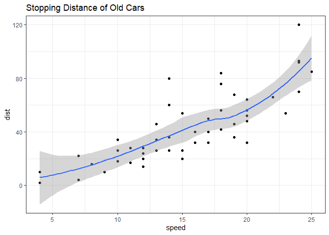
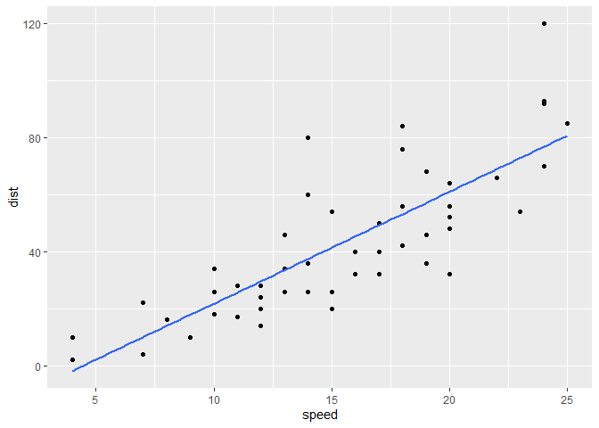
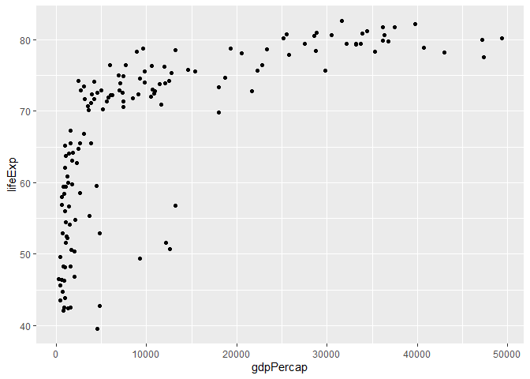
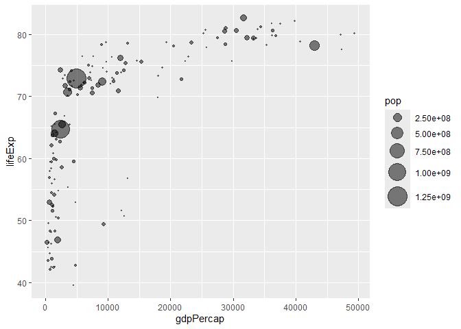
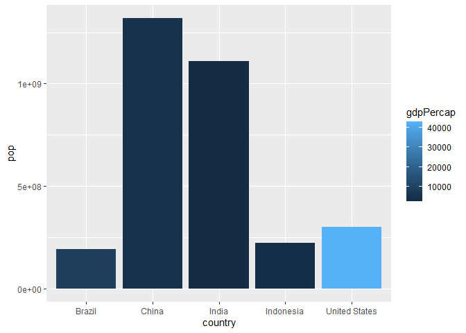
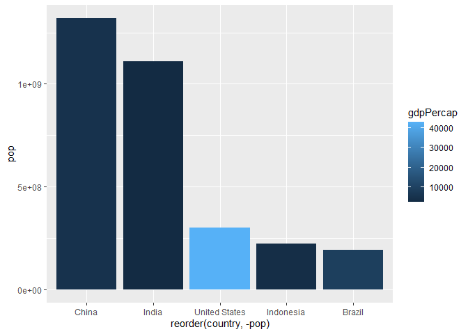

# Class 5: Data Viz with ggplot
Aigerim (PID: U09919142)
2024-01-24

# Graphics system in R

There are many graphics systems in R. These include so-called *“base R”*
and those in add-on packages like `ggplot2`.

``` r
plot(cars)
```


How can we make this with `ggplot2`

This is an odd-on package and I first need to install it on my computer.
This install is a one time only deal.

To install any package I use `install.packages()` function.

To use it we need to load up the package from our library of install
packages.For this I use `library(ggplot2)`

``` r
library(ggplot2)
```

    Warning: пакет 'ggplot2' был собран под R версии 4.3.3

``` r
ggplot(cars)
```


Using ggplot is not as straightforward as base R plot for basic plots. I
have some more typing to do.

Every ggplot has at least 3 things (layers):

-   data (data.frame)
-   aes (how the data map to the plot)
-   **geoms** (think of this as the type of plot, eg points, lines, etc)

``` r
ggplot(cars) + 
  aes(x=speed, y=dist) +
  geom_point()
```


Here ggplot was more verbose - i.e. I had more typing to do - than base
R. However, I can add more layers.

``` r
ggplot(cars) + 
  aes(speed, dist) + 
  geom_point() + 
  geom_smooth() + 
  labs(title = "Stopping Distance of Old Cars") + 
  theme_bw()
```

    `geom_smooth()` using method = 'loess' and formula = 'y ~ x'



``` r
pl <- ggplot(cars) + 
  aes(x=speed, y=dist) +
  geom_point()

pl
```


``` r
pl + geom_line()
```


``` r
ggplot(cars) +
  aes(x=speed, y=dist) +
  geom_point() +
  geom_smooth(method="lm", se=FALSE)
```

    `geom_smooth()` using formula = 'y ~ x'



``` r
library(patchwork)

(pl | pl)/ pl
```


## Lab sheet

``` r
url <- "https://bioboot.github.io/bimm143_S20/class-material/up_down_expression.txt"
genes <- read.delim(url)
head(genes)
```

            Gene Condition1 Condition2      State
    1      A4GNT -3.6808610 -3.4401355 unchanging
    2       AAAS  4.5479580  4.3864126 unchanging
    3      AASDH  3.7190695  3.4787276 unchanging
    4       AATF  5.0784720  5.0151916 unchanging
    5       AATK  0.4711421  0.5598642 unchanging
    6 AB015752.4 -3.6808610 -3.5921390 unchanging

``` r
head(genes, 2)
```

       Gene Condition1 Condition2      State
    1 A4GNT  -3.680861  -3.440135 unchanging
    2  AAAS   4.547958   4.386413 unchanging

> Q. Use the nrow() function to find out how many genes are in this
> dataset. What is your answer?

``` r
nrow(genes)
```

    [1] 5196

> Q. Use the colnames() function and the ncol() function on the genes
> data frame to find out what the column names are (we will need these
> later) and how many columns there are. How many columns did you find?

``` r
ncol(genes)
```

    [1] 4

> Q. Use the table() function on the State column of this data.frame to
> find out how many ‘up’ regulated genes there are. What is your answer?

``` r
table(genes$State)
```


          down unchanging         up 
            72       4997        127 

> Q. Using your values above and 2 significant figures. What fraction of
> total genes is up-regulated in this dataset?

``` r
round(table(genes$State) / nrow(genes) * 100, 2)
```


          down unchanging         up 
          1.39      96.17       2.44 

> Q. Nice, now add some plot annotations to the p object with the labs()
> function so your plot looks like the following:

``` r
ggplot(genes) + 
  aes(x=Condition1, y=Condition2, col=State) +
  geom_point() +
  scale_colour_manual( values=c("blue","gray","red") ) +
  labs(title = "Gene Expression Changes Upon Drug Treatment", x = "Control", y = "Drug Treatment")
```


``` r
p2 <- ggplot(genes) + 
  aes(x=Condition1, y=Condition2, col=State) +
  geom_point() +
  scale_colour_manual( values=c("blue","gray","red") ) +
  labs(title = "Gene Expression Changes Upon Drug Treatment", x="Control", y="Drug Treatment")
```

And an interactive version with `plotly`

``` r
library("plotly")
```

## Create interactive plots

``` r
#ggplotly(p2)
```

##Another example:

``` r
library("gapminder")
```

``` r
library(dplyr)
```

``` r
gapminder_2007 <- gapminder %>% filter(year==2007)
```

``` r
ggplot(gapminder_2007) +
  aes(x=gdpPercap, y=lifeExp) +
  geom_point()
```



##One useful approach here is to add an alpha=0.4 argument to your
geom_point() call to make the points slightly transparent:

``` r
ggplot(gapminder_2007) +
  aes(x=gdpPercap, y=lifeExp) +
  geom_point(alpha=0.5)
```


``` r
ggplot(gapminder_2007) +
  aes(x=gdpPercap, y=lifeExp, color=continent, size=pop) +
  geom_point(alpha=0.5)
```


``` r
ggplot(gapminder_2007) + 
  aes(x = gdpPercap, y = lifeExp, color = pop) +
  geom_point(alpha=0.8)
```


``` r
ggplot(gapminder_2007) + 
  aes(x = gdpPercap, y = lifeExp, size = pop) +
  geom_point(alpha=0.5)
```


``` r
ggplot(gapminder_2007) + 
  geom_point(aes(x = gdpPercap, y = lifeExp,
                 size = pop), alpha=0.5) + 
  scale_size_area(max_size = 10)
```



``` r
gapminder_1957 <- gapminder %>% filter(year==1957)
```

``` r
ggplot(gapminder_1957) + 
  aes(x = gdpPercap, y = lifeExp) +
  geom_point()
```


``` r
ggplot(gapminder_1957) + 
  aes(x = gdpPercap, y = lifeExp) +
  geom_point(alpha = 0.7)
```


``` r
ggplot(gapminder_1957) + 
  aes(x = gdpPercap, y = lifeExp, color = continent, size = pop) +
  geom_point(alpha = 0.7)
```


``` r
ggplot(gapminder_1957) + 
  geom_point(aes(x = gdpPercap, y = lifeExp, color = continent, size = pop), alpha = 0.7) +
  scale_size_area(max_size = 15)
```


``` r
gapminder_1957 <- gapminder %>% filter(year==1957 | year==2007)

ggplot(gapminder_1957) + 
  geom_point(aes(x = gdpPercap, y = lifeExp, color=continent,
                 size = pop), alpha=0.7) + 
  scale_size_area(max_size = 10) +
  facet_wrap(~year)
```


## Introduction to bar charts

``` r
gapminder_top5 <- gapminder %>% 
  filter(year==2007) %>% 
  arrange(desc(pop)) %>% 
  top_n(5, pop)

gapminder_top5
```

    # A tibble: 5 × 6
      country       continent  year lifeExp        pop gdpPercap
      <fct>         <fct>     <int>   <dbl>      <int>     <dbl>
    1 China         Asia       2007    73.0 1318683096     4959.
    2 India         Asia       2007    64.7 1110396331     2452.
    3 United States Americas   2007    78.2  301139947    42952.
    4 Indonesia     Asia       2007    70.6  223547000     3541.
    5 Brazil        Americas   2007    72.4  190010647     9066.

## Simple bar

``` r
ggplot(gapminder_top5) + 
  geom_col(aes(x = country, y = pop)) 
```


``` r
ggplot(gapminder_top5) + 
  geom_col(aes(x = country, y = lifeExp))
```


``` r
ggplot(gapminder_top5) + 
  geom_col(aes(x = country, y = pop, fill = continent))
```


``` r
ggplot(gapminder_top5) + 
  geom_col(aes(x = country, y = pop, fill = lifeExp))
```


``` r
ggplot(gapminder_top5) + 
  aes(x = country, y = pop, fill = gdpPercap) + 
  geom_col()
```



``` r
ggplot(gapminder_top5) +
  aes(x=reorder(country, -pop), y=pop, fill=gdpPercap) +
  geom_col()
```



## Flipping bar charts

``` r
head(USArrests)
```

               Murder Assault UrbanPop Rape
    Alabama      13.2     236       58 21.2
    Alaska       10.0     263       48 44.5
    Arizona       8.1     294       80 31.0
    Arkansas      8.8     190       50 19.5
    California    9.0     276       91 40.6
    Colorado      7.9     204       78 38.7

``` r
USArrests$State <- rownames(USArrests)
ggplot(USArrests) +
  aes(x=reorder(State,Murder), y=Murder) +
  geom_col() +
  coord_flip()
```


``` r
ggplot(USArrests) + 
  aes(x = reorder(State, Murder), y = Murder) + 
  geom_point() + 
  geom_segment(aes(x = State,
                   xend = State,
                   y = 0,
                   yend = Murder), color = "Blue") + 
  coord_flip()
```


## Combining plots

``` r
library(patchwork)

p1 <- ggplot(mtcars) + geom_point(aes(mpg, disp))
p2 <- ggplot(mtcars) + geom_boxplot(aes(gear, disp, group = gear))
p3 <- ggplot(mtcars) + geom_smooth(aes(disp, qsec))
p4 <- ggplot(mtcars) + geom_bar(aes(carb))

# Use patchwork to combine them here:
(p1 | p2 | p3) /
      p4
```

    `geom_smooth()` using method = 'loess' and formula = 'y ~ x'


