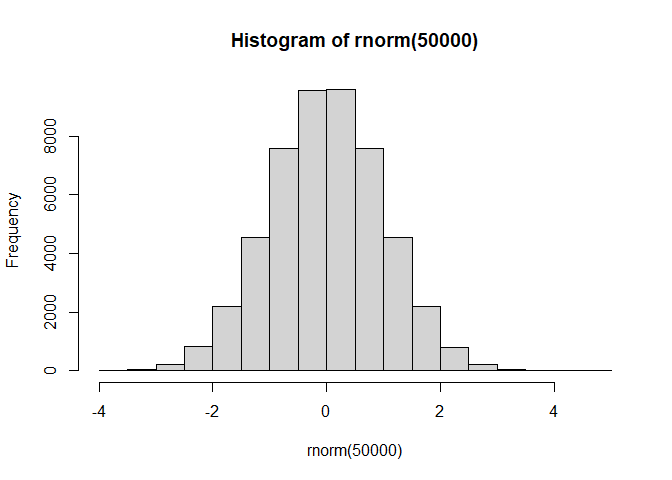

# class 7: Machine Learning 1
Aigerim (PID: 09919142)

Exploring some machine learning methods. Namely clustering and
dimensionality reduction approches.

# Kmeans clustering

The main function for k - means in “base” R is called `kmeans()`. Let’s
make first up some data to see kmen=ans works and to get at the results.

``` r
rnorm(5)
```

    [1]  0.681104034 -0.006182383 -0.256733580 -0.004353063  0.346579732

``` r
hist(rnorm(50000))
```



``` r
hist(rnorm(50000, mean=3))
```


Make a wee vector with 60 total points have centered at +3 and half
centered -3.

``` r
tmp <- c( rnorm(30, mean=3), rnorm(30, mean=-3))
tmp
```

     [1]  1.6954391  2.7955880  4.1722418  3.7963579  3.5922452  4.3170364
     [7]  2.8995635  2.9590369  3.2328743  3.8028672  3.1945170  1.4323618
    [13]  3.9957766  3.1878261  1.9409832  3.2655383  2.9869986  0.7838058
    [19]  3.7200019  3.4469961  2.9092686  3.6281868  4.1698998  2.2823772
    [25]  2.8343161  2.9764235  2.3282822  3.2535890  3.8848451  3.2389448
    [31] -2.9376675 -3.7613470 -3.7027482 -3.1074601 -5.0019981 -3.3456763
    [37] -2.3642462 -1.6313060 -3.7211571 -4.1048321 -3.9098679 -0.8145535
    [43] -2.8774972 -5.5786186 -2.2179555 -3.9341113 -3.8716212 -2.3092616
    [49] -2.3754382 -3.5627055 -2.8838748 -3.7792618 -3.0089953 -4.1714352
    [55] -2.2160736 -2.9560912 -3.7981464 -3.7704129 -2.5292330 -3.1591369

``` r
rev(1:5)
```

    [1] 5 4 3 2 1

``` r
rev(tmp)
```

     [1] -3.1591369 -2.5292330 -3.7704129 -3.7981464 -2.9560912 -2.2160736
     [7] -4.1714352 -3.0089953 -3.7792618 -2.8838748 -3.5627055 -2.3754382
    [13] -2.3092616 -3.8716212 -3.9341113 -2.2179555 -5.5786186 -2.8774972
    [19] -0.8145535 -3.9098679 -4.1048321 -3.7211571 -1.6313060 -2.3642462
    [25] -3.3456763 -5.0019981 -3.1074601 -3.7027482 -3.7613470 -2.9376675
    [31]  3.2389448  3.8848451  3.2535890  2.3282822  2.9764235  2.8343161
    [37]  2.2823772  4.1698998  3.6281868  2.9092686  3.4469961  3.7200019
    [43]  0.7838058  2.9869986  3.2655383  1.9409832  3.1878261  3.9957766
    [49]  1.4323618  3.1945170  3.8028672  3.2328743  2.9590369  2.8995635
    [55]  4.3170364  3.5922452  3.7963579  4.1722418  2.7955880  1.6954391

``` r
x <- cbind( x=tmp, y=rev(tmp)) 
x
```

                   x          y
     [1,]  1.6954391 -3.1591369
     [2,]  2.7955880 -2.5292330
     [3,]  4.1722418 -3.7704129
     [4,]  3.7963579 -3.7981464
     [5,]  3.5922452 -2.9560912
     [6,]  4.3170364 -2.2160736
     [7,]  2.8995635 -4.1714352
     [8,]  2.9590369 -3.0089953
     [9,]  3.2328743 -3.7792618
    [10,]  3.8028672 -2.8838748
    [11,]  3.1945170 -3.5627055
    [12,]  1.4323618 -2.3754382
    [13,]  3.9957766 -2.3092616
    [14,]  3.1878261 -3.8716212
    [15,]  1.9409832 -3.9341113
    [16,]  3.2655383 -2.2179555
    [17,]  2.9869986 -5.5786186
    [18,]  0.7838058 -2.8774972
    [19,]  3.7200019 -0.8145535
    [20,]  3.4469961 -3.9098679
    [21,]  2.9092686 -4.1048321
    [22,]  3.6281868 -3.7211571
    [23,]  4.1698998 -1.6313060
    [24,]  2.2823772 -2.3642462
    [25,]  2.8343161 -3.3456763
    [26,]  2.9764235 -5.0019981
    [27,]  2.3282822 -3.1074601
    [28,]  3.2535890 -3.7027482
    [29,]  3.8848451 -3.7613470
    [30,]  3.2389448 -2.9376675
    [31,] -2.9376675  3.2389448
    [32,] -3.7613470  3.8848451
    [33,] -3.7027482  3.2535890
    [34,] -3.1074601  2.3282822
    [35,] -5.0019981  2.9764235
    [36,] -3.3456763  2.8343161
    [37,] -2.3642462  2.2823772
    [38,] -1.6313060  4.1698998
    [39,] -3.7211571  3.6281868
    [40,] -4.1048321  2.9092686
    [41,] -3.9098679  3.4469961
    [42,] -0.8145535  3.7200019
    [43,] -2.8774972  0.7838058
    [44,] -5.5786186  2.9869986
    [45,] -2.2179555  3.2655383
    [46,] -3.9341113  1.9409832
    [47,] -3.8716212  3.1878261
    [48,] -2.3092616  3.9957766
    [49,] -2.3754382  1.4323618
    [50,] -3.5627055  3.1945170
    [51,] -2.8838748  3.8028672
    [52,] -3.7792618  3.2328743
    [53,] -3.0089953  2.9590369
    [54,] -4.1714352  2.8995635
    [55,] -2.2160736  4.3170364
    [56,] -2.9560912  3.5922452
    [57,] -3.7981464  3.7963579
    [58,] -3.7704129  4.1722418
    [59,] -2.5292330  2.7955880
    [60,] -3.1591369  1.6954391

``` r
x <- cbind( x=tmp, y=rev(tmp)) 
plot(x)
```


Run `kmeans()` asking for two clusters:

``` r
k <- kmeans(x, centers=2, nstart=20)
k
```

    K-means clustering with 2 clusters of sizes 30, 30

    Cluster means:
              x         y
    1  3.090806 -3.246758
    2 -3.246758  3.090806

    Clustering vector:
     [1] 1 1 1 1 1 1 1 1 1 1 1 1 1 1 1 1 1 1 1 1 1 1 1 1 1 1 1 1 1 1 2 2 2 2 2 2 2 2
    [39] 2 2 2 2 2 2 2 2 2 2 2 2 2 2 2 2 2 2 2 2 2 2

    Within cluster sum of squares by cluster:
    [1] 47.50579 47.50579
     (between_SS / total_SS =  92.7 %)

    Available components:

    [1] "cluster"      "centers"      "totss"        "withinss"     "tot.withinss"
    [6] "betweenss"    "size"         "iter"         "ifault"      

What is in this result object?

``` r
attributes(k)
```

    $names
    [1] "cluster"      "centers"      "totss"        "withinss"     "tot.withinss"
    [6] "betweenss"    "size"         "iter"         "ifault"      

    $class
    [1] "kmeans"

What is cluster center?

``` r
k$centers
```

              x         y
    1  3.090806 -3.246758
    2 -3.246758  3.090806

What is my clustering results? I.E. what cluster does each point rside
in?

``` r
k$cluster
```

     [1] 1 1 1 1 1 1 1 1 1 1 1 1 1 1 1 1 1 1 1 1 1 1 1 1 1 1 1 1 1 1 2 2 2 2 2 2 2 2
    [39] 2 2 2 2 2 2 2 2 2 2 2 2 2 2 2 2 2 2 2 2 2 2

> Q. Plot your data `x` showing your clustering result and the center
> point for each cluster?

``` r
plot(x, col = c(2,4))
```


Center is shown as green dot

``` r
plot(x, col = k$cluster)
points(k$centers, pch=15, col="green")
```


> Q. Run kmeans and cluster into 3 grps and plot the result?

``` r
k3 <- kmeans(x, centers = 3)
plot(x, col=k3$cluster)
```


``` r
k$tot.withinss
```

    [1] 95.01158

``` r
k3$tot.withinss
```

    [1] 78.20582

The big limitation of kmeans is that it imposes a structure on your
data(i.e.clustering) that you ask for in the first place.

#Hierarchical Clustering

The main function in “base” R for this is called `hlcust()`. It wants a
distance matrix as input not the data itself. We can calculate a
distance matrix in lots of different ways but here we will use the
`dist()` function.

``` r
d <- dist(x)
hc <- hclust(d)
hc
```


    Call:
    hclust(d = d)

    Cluster method   : complete 
    Distance         : euclidean 
    Number of objects: 60 

There is a specific plot method for hclust

``` r
plot(hc)
abline(h=9, col="red")
```


To get the cluster membership vector we read to “cut” the tree at a
given height that we pick. The function to do this is called `cutree()`.

``` r
cutree(hc, h=9)
```

     [1] 1 1 1 1 1 1 1 1 1 1 1 1 1 1 1 1 1 1 1 1 1 1 1 1 1 1 1 1 1 1 2 2 2 2 2 2 2 2
    [39] 2 2 2 2 2 2 2 2 2 2 2 2 2 2 2 2 2 2 2 2 2 2

``` r
cutree(hc, k=4)
```

     [1] 1 2 1 1 2 2 1 1 1 2 1 1 2 1 1 2 1 1 2 1 1 1 2 2 1 1 1 1 1 1 3 3 3 3 3 3 4 4
    [39] 3 3 3 4 3 3 4 3 3 4 3 3 4 3 3 3 4 4 3 3 4 3

``` r
grps <- cutree(hc, k=2)
grps
```

     [1] 1 1 1 1 1 1 1 1 1 1 1 1 1 1 1 1 1 1 1 1 1 1 1 1 1 1 1 1 1 1 2 2 2 2 2 2 2 2
    [39] 2 2 2 2 2 2 2 2 2 2 2 2 2 2 2 2 2 2 2 2 2 2

> Q. Plot our data (`x`) colored by our hclust result.

``` r
plot(x, col = grps)
```


#Principal Component Analysis (PCA)

We will start PCA of tiny tiny dataset and make fun of stuff Barry eats.

``` r
url <- "https://tinyurl.com/UK-foods"
x <- read.csv(url, row.names = 1)
x
```

                        England Wales Scotland N.Ireland
    Cheese                  105   103      103        66
    Carcass_meat            245   227      242       267
    Other_meat              685   803      750       586
    Fish                    147   160      122        93
    Fats_and_oils           193   235      184       209
    Sugars                  156   175      147       139
    Fresh_potatoes          720   874      566      1033
    Fresh_Veg               253   265      171       143
    Other_Veg               488   570      418       355
    Processed_potatoes      198   203      220       187
    Processed_Veg           360   365      337       334
    Fresh_fruit            1102  1137      957       674
    Cereals                1472  1582     1462      1494
    Beverages                57    73       53        47
    Soft_drinks            1374  1256     1572      1506
    Alcoholic_drinks        375   475      458       135
    Confectionery            54    64       62        41

One useful plot in this case (because we only have 4 countries to look
across) is so called pairs plot

``` r
pairs(x, col=rainbow(10), pch=16)
```


## Enter PCA

The main function to do PCA in “base” R is called `prcomp()`.

It wants our foods as the columns and the countries as rows. It
basecally wants the tranpoose pf the data we have

``` r
pca <- prcomp(t(x))
summary(pca)
```

    Importance of components:
                                PC1      PC2      PC3       PC4
    Standard deviation     324.1502 212.7478 73.87622 3.176e-14
    Proportion of Variance   0.6744   0.2905  0.03503 0.000e+00
    Cumulative Proportion    0.6744   0.9650  1.00000 1.000e+00

``` r
attributes(pca)
```

    $names
    [1] "sdev"     "rotation" "center"   "scale"    "x"       

    $class
    [1] "prcomp"

``` r
pca$x
```

                     PC1         PC2        PC3           PC4
    England   -144.99315   -2.532999 105.768945 -4.894696e-14
    Wales     -240.52915 -224.646925 -56.475555  5.700024e-13
    Scotland   -91.86934  286.081786 -44.415495 -7.460785e-13
    N.Ireland  477.39164  -58.901862  -4.877895  2.321303e-13

``` r
pca$rotation
```

                                 PC1          PC2         PC3          PC4
    Cheese              -0.056955380  0.016012850  0.02394295 -0.694538519
    Carcass_meat         0.047927628  0.013915823  0.06367111  0.489884628
    Other_meat          -0.258916658 -0.015331138 -0.55384854  0.279023718
    Fish                -0.084414983 -0.050754947  0.03906481 -0.008483145
    Fats_and_oils       -0.005193623 -0.095388656 -0.12522257  0.076097502
    Sugars              -0.037620983 -0.043021699 -0.03605745  0.034101334
    Fresh_potatoes       0.401402060 -0.715017078 -0.20668248 -0.090972715
    Fresh_Veg           -0.151849942 -0.144900268  0.21382237 -0.039901917
    Other_Veg           -0.243593729 -0.225450923 -0.05332841  0.016719075
    Processed_potatoes  -0.026886233  0.042850761 -0.07364902  0.030125166
    Processed_Veg       -0.036488269 -0.045451802  0.05289191 -0.013969507
    Fresh_fruit         -0.632640898 -0.177740743  0.40012865  0.184072217
    Cereals             -0.047702858 -0.212599678 -0.35884921  0.191926714
    Beverages           -0.026187756 -0.030560542 -0.04135860  0.004831876
    Soft_drinks          0.232244140  0.555124311 -0.16942648  0.103508492
    Alcoholic_drinks    -0.463968168  0.113536523 -0.49858320 -0.316290619
    Confectionery       -0.029650201  0.005949921 -0.05232164  0.001847469

``` r
plot(pca$x[,1], pca$x[,2], xlab = "PC1(67.4%)", ylab="PC2(29%)",
     col=c("orange", "red", "blue", "darkgreen"), pch=15)
abline(h=0, col="grey", lty=2)
abline(h=0, col="grey", lty=2)
```


