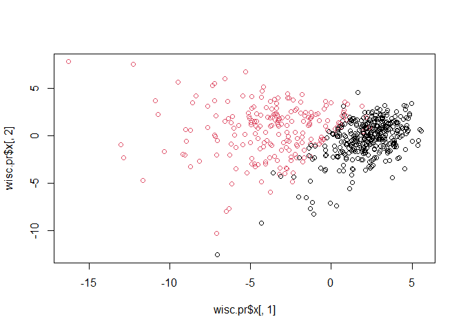
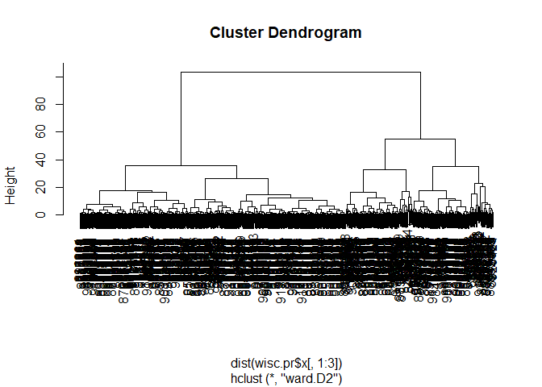

# class 8: Breast Cancer Mini Project
Aigerim (PID: 09919142)

The goal of this mini-project is for you to explore a complete analysis
using the unsupervised learning techniques covered in class. You’ll
extend what you’ve learned by combining PCA as a preprocessing step to
clustering using data that consist of measurements of cell nuclei of
human breast masses. This expands on our RNA-Seq analysis from last day.

Our data for today come form FNA breast tissue.

## 1. Preparing the data

> **Q1.** How many observations are in this dataset?

**569 observations of 30 variables**

``` r
wisc.df <- read.csv("https://bioboot.github.io/bimm143_S20/class-material/WisconsinCancer.csv", row.names = 1)
head(wisc.df)
```

             diagnosis radius_mean texture_mean perimeter_mean area_mean
    842302           M       17.99        10.38         122.80    1001.0
    842517           M       20.57        17.77         132.90    1326.0
    84300903         M       19.69        21.25         130.00    1203.0
    84348301         M       11.42        20.38          77.58     386.1
    84358402         M       20.29        14.34         135.10    1297.0
    843786           M       12.45        15.70          82.57     477.1
             smoothness_mean compactness_mean concavity_mean concave.points_mean
    842302           0.11840          0.27760         0.3001             0.14710
    842517           0.08474          0.07864         0.0869             0.07017
    84300903         0.10960          0.15990         0.1974             0.12790
    84348301         0.14250          0.28390         0.2414             0.10520
    84358402         0.10030          0.13280         0.1980             0.10430
    843786           0.12780          0.17000         0.1578             0.08089
             symmetry_mean fractal_dimension_mean radius_se texture_se perimeter_se
    842302          0.2419                0.07871    1.0950     0.9053        8.589
    842517          0.1812                0.05667    0.5435     0.7339        3.398
    84300903        0.2069                0.05999    0.7456     0.7869        4.585
    84348301        0.2597                0.09744    0.4956     1.1560        3.445
    84358402        0.1809                0.05883    0.7572     0.7813        5.438
    843786          0.2087                0.07613    0.3345     0.8902        2.217
             area_se smoothness_se compactness_se concavity_se concave.points_se
    842302    153.40      0.006399        0.04904      0.05373           0.01587
    842517     74.08      0.005225        0.01308      0.01860           0.01340
    84300903   94.03      0.006150        0.04006      0.03832           0.02058
    84348301   27.23      0.009110        0.07458      0.05661           0.01867
    84358402   94.44      0.011490        0.02461      0.05688           0.01885
    843786     27.19      0.007510        0.03345      0.03672           0.01137
             symmetry_se fractal_dimension_se radius_worst texture_worst
    842302       0.03003             0.006193        25.38         17.33
    842517       0.01389             0.003532        24.99         23.41
    84300903     0.02250             0.004571        23.57         25.53
    84348301     0.05963             0.009208        14.91         26.50
    84358402     0.01756             0.005115        22.54         16.67
    843786       0.02165             0.005082        15.47         23.75
             perimeter_worst area_worst smoothness_worst compactness_worst
    842302            184.60     2019.0           0.1622            0.6656
    842517            158.80     1956.0           0.1238            0.1866
    84300903          152.50     1709.0           0.1444            0.4245
    84348301           98.87      567.7           0.2098            0.8663
    84358402          152.20     1575.0           0.1374            0.2050
    843786            103.40      741.6           0.1791            0.5249
             concavity_worst concave.points_worst symmetry_worst
    842302            0.7119               0.2654         0.4601
    842517            0.2416               0.1860         0.2750
    84300903          0.4504               0.2430         0.3613
    84348301          0.6869               0.2575         0.6638
    84358402          0.4000               0.1625         0.2364
    843786            0.5355               0.1741         0.3985
             fractal_dimension_worst
    842302                   0.11890
    842517                   0.08902
    84300903                 0.08758
    84348301                 0.17300
    84358402                 0.07678
    843786                   0.12440

> **Q2.** How many of the observations have a malignant diagnosis?

**212**

``` r
sum(wisc.df$diagnosis == "M")
```

    [1] 212

``` r
sum(wisc.df$diagnosis == "B")
```

    [1] 357

``` r
#the best one: 
table(wisc.df$diagnosis)
```


      B   M 
    357 212 

> **Q3.** How many variables/features in the data are suffixed with
> \_mean?

**10:**  
\[1\] 2 3 4 5 6 7 8 9 10 11 \[1\] 10

``` r
grep("..mean", colnames(wisc.df))
```

     [1]  2  3  4  5  6  7  8  9 10 11

``` r
length(grep("..mean", colnames(wisc.df)))
```

    [1] 10

``` r
ncol(wisc.df)
```

    [1] 31

Save diagnosis for reference later

``` r
diagnosis <- as.factor(wisc.df$diagnosis)
```

and remove or exclude this column form any of our analysis

``` r
wisc.data <- wisc.df[,-1]
```

Let’s try clustering this data:

Hierarchical Clustering with `hclust`

``` r
wisc.hc <- hclust(dist(wisc.data))
plot(wisc.hc)
```


## 2. Principal Component Analysis

Let’s try PCA on this data. Before doing any analysis like this we
should check if our input data needs to be scalled first?

Side-note:

``` r
head(mtcars)
```

                       mpg cyl disp  hp drat    wt  qsec vs am gear carb
    Mazda RX4         21.0   6  160 110 3.90 2.620 16.46  0  1    4    4
    Mazda RX4 Wag     21.0   6  160 110 3.90 2.875 17.02  0  1    4    4
    Datsun 710        22.8   4  108  93 3.85 2.320 18.61  1  1    4    1
    Hornet 4 Drive    21.4   6  258 110 3.08 3.215 19.44  1  0    3    1
    Hornet Sportabout 18.7   8  360 175 3.15 3.440 17.02  0  0    3    2
    Valiant           18.1   6  225 105 2.76 3.460 20.22  1  0    3    1

``` r
apply(mtcars, 2, mean)
```

           mpg        cyl       disp         hp       drat         wt       qsec 
     20.090625   6.187500 230.721875 146.687500   3.596563   3.217250  17.848750 
            vs         am       gear       carb 
      0.437500   0.406250   3.687500   2.812500 

``` r
apply(mtcars, 2, sd)
```

            mpg         cyl        disp          hp        drat          wt 
      6.0269481   1.7859216 123.9386938  68.5628685   0.5346787   0.9784574 
           qsec          vs          am        gear        carb 
      1.7869432   0.5040161   0.4989909   0.7378041   1.6152000 

Let’s try PCA on this cars dataset

``` r
pc <- prcomp(mtcars)
summary(pc)
```

    Importance of components:
                               PC1      PC2     PC3     PC4     PC5     PC6    PC7
    Standard deviation     136.533 38.14808 3.07102 1.30665 0.90649 0.66354 0.3086
    Proportion of Variance   0.927  0.07237 0.00047 0.00008 0.00004 0.00002 0.0000
    Cumulative Proportion    0.927  0.99937 0.99984 0.99992 0.99996 0.99998 1.0000
                             PC8    PC9   PC10   PC11
    Standard deviation     0.286 0.2507 0.2107 0.1984
    Proportion of Variance 0.000 0.0000 0.0000 0.0000
    Cumulative Proportion  1.000 1.0000 1.0000 1.0000

``` r
biplot(pc)
```


``` r
pc.scale <- prcomp(mtcars, scale=TRUE)
summary(pc.scale)
```

    Importance of components:
                              PC1    PC2     PC3     PC4     PC5     PC6    PC7
    Standard deviation     2.5707 1.6280 0.79196 0.51923 0.47271 0.46000 0.3678
    Proportion of Variance 0.6008 0.2409 0.05702 0.02451 0.02031 0.01924 0.0123
    Cumulative Proportion  0.6008 0.8417 0.89873 0.92324 0.94356 0.96279 0.9751
                               PC8    PC9    PC10   PC11
    Standard deviation     0.35057 0.2776 0.22811 0.1485
    Proportion of Variance 0.01117 0.0070 0.00473 0.0020
    Cumulative Proportion  0.98626 0.9933 0.99800 1.0000

``` r
biplot(pc.scale)
```


After scaling all the deviations spread the data.

# Back to our cancer data set

# Performing PCA

Do we need to scale this data set? Yes, we do because the spread is very
different.

``` r
wisc.pr <- prcomp(wisc.data, scale=TRUE)
```

How well do the PCs capture the variance in the original data?

``` r
summary(wisc.pr)
```

    Importance of components:
                              PC1    PC2     PC3     PC4     PC5     PC6     PC7
    Standard deviation     3.6444 2.3857 1.67867 1.40735 1.28403 1.09880 0.82172
    Proportion of Variance 0.4427 0.1897 0.09393 0.06602 0.05496 0.04025 0.02251
    Cumulative Proportion  0.4427 0.6324 0.72636 0.79239 0.84734 0.88759 0.91010
                               PC8    PC9    PC10   PC11    PC12    PC13    PC14
    Standard deviation     0.69037 0.6457 0.59219 0.5421 0.51104 0.49128 0.39624
    Proportion of Variance 0.01589 0.0139 0.01169 0.0098 0.00871 0.00805 0.00523
    Cumulative Proportion  0.92598 0.9399 0.95157 0.9614 0.97007 0.97812 0.98335
                              PC15    PC16    PC17    PC18    PC19    PC20   PC21
    Standard deviation     0.30681 0.28260 0.24372 0.22939 0.22244 0.17652 0.1731
    Proportion of Variance 0.00314 0.00266 0.00198 0.00175 0.00165 0.00104 0.0010
    Cumulative Proportion  0.98649 0.98915 0.99113 0.99288 0.99453 0.99557 0.9966
                              PC22    PC23   PC24    PC25    PC26    PC27    PC28
    Standard deviation     0.16565 0.15602 0.1344 0.12442 0.09043 0.08307 0.03987
    Proportion of Variance 0.00091 0.00081 0.0006 0.00052 0.00027 0.00023 0.00005
    Cumulative Proportion  0.99749 0.99830 0.9989 0.99942 0.99969 0.99992 0.99997
                              PC29    PC30
    Standard deviation     0.02736 0.01153
    Proportion of Variance 0.00002 0.00000
    Cumulative Proportion  1.00000 1.00000

> Q4. From your results, what proportion of the original variance is
> captured by the first principal components (PC1)?

**Proportion of Variance** **PC1: 0.44272** **44,27%**

> Q5. How many principal components (PCs) are required to describe at
> least 70% of the original variance in the data?

**Number of PCs to explain at least 70% of variance: 5. For 70% of the
variance, we need to consider the cumulative proportion up to the point
where it exceeds 70%.**

> Q6. How many principal components (PCs) are required to describe at
> least 90% of the original variance in the data?

**Number of PCs to explain at least 90% of variance: 24**

Our main PC score plot (a.k.a. PC plot, PC1 vs PC2, ordeiation plot)

``` r
attributes(wisc.pr)
```

    $names
    [1] "sdev"     "rotation" "center"   "scale"    "x"       

    $class
    [1] "prcomp"

> Q7. What stands out to you about this plot? Is it easy or difficult to
> understand? Why?

**Row names are cluttering the plot and making it difficult to
interpret**

``` r
biplot(wisc.pr)
```


We need to build our own plot here:

``` r
plot(wisc.pr$x[,1], wisc.pr$x[,2], col=diagnosis)
```



> Q8. Generate a similar plot for principal components 1 and 3. What do
> you notice about these plots?

**Principal component 1 is capturing a separation of malignant (red)
from benign (black) samples. Principal component 2 explains more
variance in the original data than principal component 3. We can see
that the first plot has a cleaner cut separating the two subgroups.**

``` r
# Repeat for components 1 and 3
plot(wisc.pr$x[,1], wisc.pr$x[,3], col=diagnosis)
```


Make a nice ggplot version

``` r
pc <- as.data.frame(wisc.pr$x)
library(ggplot2)
```

    Warning: пакет 'ggplot2' был собран под R версии 4.3.3

``` r
ggplot(pc) +
  aes(PC1, PC2, col=diagnosis) +
  geom_point()
```


## Variance explained

``` r
v <- summary(wisc.pr)
v$importance[2,]
```

        PC1     PC2     PC3     PC4     PC5     PC6     PC7     PC8     PC9    PC10 
    0.44272 0.18971 0.09393 0.06602 0.05496 0.04025 0.02251 0.01589 0.01390 0.01169 
       PC11    PC12    PC13    PC14    PC15    PC16    PC17    PC18    PC19    PC20 
    0.00980 0.00871 0.00805 0.00523 0.00314 0.00266 0.00198 0.00175 0.00165 0.00104 
       PC21    PC22    PC23    PC24    PC25    PC26    PC27    PC28    PC29    PC30 
    0.00100 0.00091 0.00081 0.00060 0.00052 0.00027 0.00023 0.00005 0.00002 0.00000 

``` r
plot(v$importance[2,], xlab = "Principal Component", 
     ylab = "Proportion of Variance Explained", 
     ylim = c(0, 1), type = "o")
```


``` r
barplot(v$importance[2,], ylab = "Precent of Variance Explained",
     names.arg=paste0("PC",1:length(v$importance[2,])), las=2, axes = FALSE)
axis(2, at=v$importance[2,], labels=round(v$importance[2,],2)*100 )
```


``` r
## ggplot based graph
#install.packages("factoextra")
library(factoextra)
```

    Welcome! Want to learn more? See two factoextra-related books at https://goo.gl/ve3WBa

``` r
fviz_eig(wisc.pr, addlabels = TRUE)
```


> Q9. For the first principal component, what is the component of the
> loading vector (i.e. wisc.pr$rotation\[,1\]) for the feature
> concave.points_mean? This tells us how much this original feature
> contributes to the first PC.

**-0.2608538**

``` r
loading_for_PC1 <- wisc.pr$rotation[, 1]
concave_points_mean <- loading_for_PC1["concave.points_mean"]
cat("Loading for concave.points_mean in PC1:", concave_points_mean, "\n")
```

    Loading for concave.points_mean in PC1: -0.2608538 

## 4. Combining methods

Here we will use the results of PCA as the input to a clustering
analysis.

We start with using 3 PCs

``` r
wisc.pr.hslust <- hclust(dist(wisc.pr$x[,1:3]), method="ward.D2")
plot(wisc.pr.hslust)
```



> Q10. Using the plot() and abline() functions, what is the height at
> which the clustering model has 4 clusters? **height = 80**

``` r
plot(wisc.pr.hslust)
abline(h=80, col="red")
```


> Q12. Which method gives your favorite results for the same data.dist
> dataset? Explain your reasoning.

(“single”): The distance between two clusters is defined as the shortest
distance between any two points in the clusters. It tends to produce
elongated clusters.

(“complete”): The distance between two clusters is defined as the
maximum distance between their individual points. It tends to produce
compact, spherical clusters.

(“average”): The distance between two clusters is defined as the average
distance between their individual points. It aims to balance between the
effects of single and complete linkage.

(“ward.D2”): Minimizes the variance within clusters. It is often
considered robust and suitable for spherical clusters.

> Q13. How well does the newly created model with four clusters separate
> out the two diagnoses?

The answer:

``` r
grps <- cutree(wisc.pr.hslust, h=80)
table(grps)
```

    grps
      1   2 
    203 366 

``` r
table(diagnosis)
```

    diagnosis
      B   M 
    357 212 

> Q14. How well do the hierarchical clustering models you created in
> previous sections (i.e. before PCA) do in terms of separating the
> diagnoses? Again, use the table() function to compare the output of
> each model (wisc.km$cluster and wisc.hclust.clusters) with the vector
> containing the actual diagnoses.

``` r
table(grps, diagnosis)
```

        diagnosis
    grps   B   M
       1  24 179
       2 333  33

## 5. Sensitivity/Specificity

> Q15. OPTIONAL: Which of your analysis procedures resulted in a
> clustering model with the best specificity? How about sensitivity?

sensitivity: TP/(TP+FN): 0.8 specificity: TN/(TN+FN): 0.9

## 6. Prediction

``` r
#url <- "new_samples.csv"
url <- "https://tinyurl.com/new-samples-CSV"
new <- read.csv(url)
npc <- predict(wisc.pr, newdata=new)
npc
```

               PC1       PC2        PC3        PC4       PC5        PC6        PC7
    [1,]  2.576616 -3.135913  1.3990492 -0.7631950  2.781648 -0.8150185 -0.3959098
    [2,] -4.754928 -3.009033 -0.1660946 -0.6052952 -1.140698 -1.2189945  0.8193031
                PC8       PC9       PC10      PC11      PC12      PC13     PC14
    [1,] -0.2307350 0.1029569 -0.9272861 0.3411457  0.375921 0.1610764 1.187882
    [2,] -0.3307423 0.5281896 -0.4855301 0.7173233 -1.185917 0.5893856 0.303029
              PC15       PC16        PC17        PC18        PC19       PC20
    [1,] 0.3216974 -0.1743616 -0.07875393 -0.11207028 -0.08802955 -0.2495216
    [2,] 0.1299153  0.1448061 -0.40509706  0.06565549  0.25591230 -0.4289500
               PC21       PC22       PC23       PC24        PC25         PC26
    [1,]  0.1228233 0.09358453 0.08347651  0.1223396  0.02124121  0.078884581
    [2,] -0.1224776 0.01732146 0.06316631 -0.2338618 -0.20755948 -0.009833238
                 PC27        PC28         PC29         PC30
    [1,]  0.220199544 -0.02946023 -0.015620933  0.005269029
    [2,] -0.001134152  0.09638361  0.002795349 -0.019015820

``` r
plot(wisc.pr$x[,1:2], col=diagnosis)
points(npc[,1], npc[,2], col="blue", pch=16, cex=3)
text(npc[,1], npc[,2], c(1,2), col="white")
```


> Q16. Which of these new patients should we prioritize for follow up
> based on your results?

2
