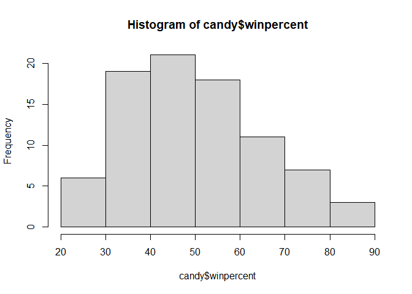

# class 9: Halloween Mini-Project
Aigerim (PID: 09919142)

Today we will analyze some data from 538 (FiveThirtyEight) about Typical
Halloween candy.

## Importing candy data

First thing to do is to download `candy-data.csv` and `read.csv` it.In
my case, my file were downloaded as .txt file, so pay attention to how
we call it.

``` r
candy <- read.csv("candy-data.txt", row.names=1)
head(candy)
```

                 chocolate fruity caramel peanutyalmondy nougat crispedricewafer
    100 Grand            1      0       1              0      0                1
    3 Musketeers         1      0       0              0      1                0
    One dime             0      0       0              0      0                0
    One quarter          0      0       0              0      0                0
    Air Heads            0      1       0              0      0                0
    Almond Joy           1      0       0              1      0                0
                 hard bar pluribus sugarpercent pricepercent winpercent
    100 Grand       0   1        0        0.732        0.860   66.97173
    3 Musketeers    0   1        0        0.604        0.511   67.60294
    One dime        0   0        0        0.011        0.116   32.26109
    One quarter     0   0        0        0.011        0.511   46.11650
    Air Heads       0   0        0        0.906        0.511   52.34146
    Almond Joy      0   1        0        0.465        0.767   50.34755

> Q1. How many different candy types are in this dataset?

12 candy types

``` r
dim(candy)
```

    [1] 85 12

> Q2. How many chocolate candy types are in the dataset?

``` r
sum(candy$chocolate)
```

    [1] 37

> Q. How many variables/dimensiions are there?

``` r
nrow(candy)
```

    [1] 85

## Data exploration

# What is your favorate candy?

“skimr” install it in your console

``` r
#library(skimr)

skimr::skim(candy)
```

<table>
<caption>Data summary</caption>
<tbody>
<tr class="odd">
<td style="text-align: left;">Name</td>
<td style="text-align: left;">candy</td>
</tr>
<tr class="even">
<td style="text-align: left;">Number of rows</td>
<td style="text-align: left;">85</td>
</tr>
<tr class="odd">
<td style="text-align: left;">Number of columns</td>
<td style="text-align: left;">12</td>
</tr>
<tr class="even">
<td style="text-align: left;">_______________________</td>
<td style="text-align: left;"></td>
</tr>
<tr class="odd">
<td style="text-align: left;">Column type frequency:</td>
<td style="text-align: left;"></td>
</tr>
<tr class="even">
<td style="text-align: left;">numeric</td>
<td style="text-align: left;">12</td>
</tr>
<tr class="odd">
<td style="text-align: left;">________________________</td>
<td style="text-align: left;"></td>
</tr>
<tr class="even">
<td style="text-align: left;">Group variables</td>
<td style="text-align: left;">None</td>
</tr>
</tbody>
</table>

Data summary

**Variable type: numeric**

<table style="width:100%;">
<colgroup>
<col style="width: 19%" />
<col style="width: 11%" />
<col style="width: 15%" />
<col style="width: 6%" />
<col style="width: 6%" />
<col style="width: 6%" />
<col style="width: 6%" />
<col style="width: 6%" />
<col style="width: 6%" />
<col style="width: 6%" />
<col style="width: 6%" />
</colgroup>
<thead>
<tr class="header">
<th style="text-align: left;">skim_variable</th>
<th style="text-align: right;">n_missing</th>
<th style="text-align: right;">complete_rate</th>
<th style="text-align: right;">mean</th>
<th style="text-align: right;">sd</th>
<th style="text-align: right;">p0</th>
<th style="text-align: right;">p25</th>
<th style="text-align: right;">p50</th>
<th style="text-align: right;">p75</th>
<th style="text-align: right;">p100</th>
<th style="text-align: left;">hist</th>
</tr>
</thead>
<tbody>
<tr class="odd">
<td style="text-align: left;">chocolate</td>
<td style="text-align: right;">0</td>
<td style="text-align: right;">1</td>
<td style="text-align: right;">0.44</td>
<td style="text-align: right;">0.50</td>
<td style="text-align: right;">0.00</td>
<td style="text-align: right;">0.00</td>
<td style="text-align: right;">0.00</td>
<td style="text-align: right;">1.00</td>
<td style="text-align: right;">1.00</td>
<td style="text-align: left;">▇▁▁▁▆</td>
</tr>
<tr class="even">
<td style="text-align: left;">fruity</td>
<td style="text-align: right;">0</td>
<td style="text-align: right;">1</td>
<td style="text-align: right;">0.45</td>
<td style="text-align: right;">0.50</td>
<td style="text-align: right;">0.00</td>
<td style="text-align: right;">0.00</td>
<td style="text-align: right;">0.00</td>
<td style="text-align: right;">1.00</td>
<td style="text-align: right;">1.00</td>
<td style="text-align: left;">▇▁▁▁▆</td>
</tr>
<tr class="odd">
<td style="text-align: left;">caramel</td>
<td style="text-align: right;">0</td>
<td style="text-align: right;">1</td>
<td style="text-align: right;">0.16</td>
<td style="text-align: right;">0.37</td>
<td style="text-align: right;">0.00</td>
<td style="text-align: right;">0.00</td>
<td style="text-align: right;">0.00</td>
<td style="text-align: right;">0.00</td>
<td style="text-align: right;">1.00</td>
<td style="text-align: left;">▇▁▁▁▂</td>
</tr>
<tr class="even">
<td style="text-align: left;">peanutyalmondy</td>
<td style="text-align: right;">0</td>
<td style="text-align: right;">1</td>
<td style="text-align: right;">0.16</td>
<td style="text-align: right;">0.37</td>
<td style="text-align: right;">0.00</td>
<td style="text-align: right;">0.00</td>
<td style="text-align: right;">0.00</td>
<td style="text-align: right;">0.00</td>
<td style="text-align: right;">1.00</td>
<td style="text-align: left;">▇▁▁▁▂</td>
</tr>
<tr class="odd">
<td style="text-align: left;">nougat</td>
<td style="text-align: right;">0</td>
<td style="text-align: right;">1</td>
<td style="text-align: right;">0.08</td>
<td style="text-align: right;">0.28</td>
<td style="text-align: right;">0.00</td>
<td style="text-align: right;">0.00</td>
<td style="text-align: right;">0.00</td>
<td style="text-align: right;">0.00</td>
<td style="text-align: right;">1.00</td>
<td style="text-align: left;">▇▁▁▁▁</td>
</tr>
<tr class="even">
<td style="text-align: left;">crispedricewafer</td>
<td style="text-align: right;">0</td>
<td style="text-align: right;">1</td>
<td style="text-align: right;">0.08</td>
<td style="text-align: right;">0.28</td>
<td style="text-align: right;">0.00</td>
<td style="text-align: right;">0.00</td>
<td style="text-align: right;">0.00</td>
<td style="text-align: right;">0.00</td>
<td style="text-align: right;">1.00</td>
<td style="text-align: left;">▇▁▁▁▁</td>
</tr>
<tr class="odd">
<td style="text-align: left;">hard</td>
<td style="text-align: right;">0</td>
<td style="text-align: right;">1</td>
<td style="text-align: right;">0.18</td>
<td style="text-align: right;">0.38</td>
<td style="text-align: right;">0.00</td>
<td style="text-align: right;">0.00</td>
<td style="text-align: right;">0.00</td>
<td style="text-align: right;">0.00</td>
<td style="text-align: right;">1.00</td>
<td style="text-align: left;">▇▁▁▁▂</td>
</tr>
<tr class="even">
<td style="text-align: left;">bar</td>
<td style="text-align: right;">0</td>
<td style="text-align: right;">1</td>
<td style="text-align: right;">0.25</td>
<td style="text-align: right;">0.43</td>
<td style="text-align: right;">0.00</td>
<td style="text-align: right;">0.00</td>
<td style="text-align: right;">0.00</td>
<td style="text-align: right;">0.00</td>
<td style="text-align: right;">1.00</td>
<td style="text-align: left;">▇▁▁▁▂</td>
</tr>
<tr class="odd">
<td style="text-align: left;">pluribus</td>
<td style="text-align: right;">0</td>
<td style="text-align: right;">1</td>
<td style="text-align: right;">0.52</td>
<td style="text-align: right;">0.50</td>
<td style="text-align: right;">0.00</td>
<td style="text-align: right;">0.00</td>
<td style="text-align: right;">1.00</td>
<td style="text-align: right;">1.00</td>
<td style="text-align: right;">1.00</td>
<td style="text-align: left;">▇▁▁▁▇</td>
</tr>
<tr class="even">
<td style="text-align: left;">sugarpercent</td>
<td style="text-align: right;">0</td>
<td style="text-align: right;">1</td>
<td style="text-align: right;">0.48</td>
<td style="text-align: right;">0.28</td>
<td style="text-align: right;">0.01</td>
<td style="text-align: right;">0.22</td>
<td style="text-align: right;">0.47</td>
<td style="text-align: right;">0.73</td>
<td style="text-align: right;">0.99</td>
<td style="text-align: left;">▇▇▇▇▆</td>
</tr>
<tr class="odd">
<td style="text-align: left;">pricepercent</td>
<td style="text-align: right;">0</td>
<td style="text-align: right;">1</td>
<td style="text-align: right;">0.47</td>
<td style="text-align: right;">0.29</td>
<td style="text-align: right;">0.01</td>
<td style="text-align: right;">0.26</td>
<td style="text-align: right;">0.47</td>
<td style="text-align: right;">0.65</td>
<td style="text-align: right;">0.98</td>
<td style="text-align: left;">▇▇▇▇▆</td>
</tr>
<tr class="even">
<td style="text-align: left;">winpercent</td>
<td style="text-align: right;">0</td>
<td style="text-align: right;">1</td>
<td style="text-align: right;">50.32</td>
<td style="text-align: right;">14.71</td>
<td style="text-align: right;">22.45</td>
<td style="text-align: right;">39.14</td>
<td style="text-align: right;">47.83</td>
<td style="text-align: right;">59.86</td>
<td style="text-align: right;">84.18</td>
<td style="text-align: left;">▃▇▆▅▂</td>
</tr>
</tbody>
</table>

> Q3. What is your favorite candy in the dataset and what is it’s
> winpercent value?

Mine favorite candy is M&M’s and it’s winpercent is 66.57

``` r
candy["M&M's",]
```

          chocolate fruity caramel peanutyalmondy nougat crispedricewafer hard bar
    M&M's         1      0       0              0      0                0    0   0
          pluribus sugarpercent pricepercent winpercent
    M&M's        1        0.825        0.651   66.57458

``` r
candy["Twix",]$winpercent
```

    [1] 81.64291

> Q4. What is the winpercent value for “Kit Kat”?

``` r
candy["Kit Kat", ]$winpercent
```

    [1] 76.7686

> Q5. What is the winpercent value for “Tootsie Roll Snack Bars”?

``` r
candy["Tootsie Roll Snack Bars", ]$winpercent
```

    [1] 49.6535

> > Q6. Is there any variable/column that looks to be on a different
> > scale to the majority of the other columns in the dataset?

``` r
cor(candy)
```

                      chocolate      fruity     caramel peanutyalmondy      nougat
    chocolate         1.0000000 -0.74172106  0.24987535     0.37782357  0.25489183
    fruity           -0.7417211  1.00000000 -0.33548538    -0.39928014 -0.26936712
    caramel           0.2498753 -0.33548538  1.00000000     0.05935614  0.32849280
    peanutyalmondy    0.3778236 -0.39928014  0.05935614     1.00000000  0.21311310
    nougat            0.2548918 -0.26936712  0.32849280     0.21311310  1.00000000
    crispedricewafer  0.3412098 -0.26936712  0.21311310    -0.01764631 -0.08974359
    hard             -0.3441769  0.39067750 -0.12235513    -0.20555661 -0.13867505
    bar               0.5974211 -0.51506558  0.33396002     0.26041960  0.52297636
    pluribus         -0.3396752  0.29972522 -0.26958501    -0.20610932 -0.31033884
    sugarpercent      0.1041691 -0.03439296  0.22193335     0.08788927  0.12308135
    pricepercent      0.5046754 -0.43096853  0.25432709     0.30915323  0.15319643
    winpercent        0.6365167 -0.38093814  0.21341630     0.40619220  0.19937530
                     crispedricewafer        hard         bar    pluribus
    chocolate              0.34120978 -0.34417691  0.59742114 -0.33967519
    fruity                -0.26936712  0.39067750 -0.51506558  0.29972522
    caramel                0.21311310 -0.12235513  0.33396002 -0.26958501
    peanutyalmondy        -0.01764631 -0.20555661  0.26041960 -0.20610932
    nougat                -0.08974359 -0.13867505  0.52297636 -0.31033884
    crispedricewafer       1.00000000 -0.13867505  0.42375093 -0.22469338
    hard                  -0.13867505  1.00000000 -0.26516504  0.01453172
    bar                    0.42375093 -0.26516504  1.00000000 -0.59340892
    pluribus              -0.22469338  0.01453172 -0.59340892  1.00000000
    sugarpercent           0.06994969  0.09180975  0.09998516  0.04552282
    pricepercent           0.32826539 -0.24436534  0.51840654 -0.22079363
    winpercent             0.32467965 -0.31038158  0.42992933 -0.24744787
                     sugarpercent pricepercent winpercent
    chocolate          0.10416906    0.5046754  0.6365167
    fruity            -0.03439296   -0.4309685 -0.3809381
    caramel            0.22193335    0.2543271  0.2134163
    peanutyalmondy     0.08788927    0.3091532  0.4061922
    nougat             0.12308135    0.1531964  0.1993753
    crispedricewafer   0.06994969    0.3282654  0.3246797
    hard               0.09180975   -0.2443653 -0.3103816
    bar                0.09998516    0.5184065  0.4299293
    pluribus           0.04552282   -0.2207936 -0.2474479
    sugarpercent       1.00000000    0.3297064  0.2291507
    pricepercent       0.32970639    1.0000000  0.3453254
    winpercent         0.22915066    0.3453254  1.0000000

> Q7. What do you think a zero and one represent for the candy$chocolate
> column

The sequence might represent Boolean values, where 1 could mean “TRUE”
or “yes” and 0 could mean “FALSE” or “no”.

``` r
candy$chocolate
```

     [1] 1 1 0 0 0 1 1 0 0 0 1 0 0 0 0 0 0 0 0 0 0 0 1 1 1 1 0 1 1 0 0 0 1 1 0 1 1 1
    [39] 1 1 1 0 1 1 0 0 0 1 0 0 0 1 1 1 1 0 1 0 0 1 0 0 1 0 1 1 0 0 0 0 0 0 0 0 1 1
    [77] 1 1 0 1 0 0 0 0 1

Or we can use `as.logical()`

``` r
as.logical(candy$chocolate)
```

     [1]  TRUE  TRUE FALSE FALSE FALSE  TRUE  TRUE FALSE FALSE FALSE  TRUE FALSE
    [13] FALSE FALSE FALSE FALSE FALSE FALSE FALSE FALSE FALSE FALSE  TRUE  TRUE
    [25]  TRUE  TRUE FALSE  TRUE  TRUE FALSE FALSE FALSE  TRUE  TRUE FALSE  TRUE
    [37]  TRUE  TRUE  TRUE  TRUE  TRUE FALSE  TRUE  TRUE FALSE FALSE FALSE  TRUE
    [49] FALSE FALSE FALSE  TRUE  TRUE  TRUE  TRUE FALSE  TRUE FALSE FALSE  TRUE
    [61] FALSE FALSE  TRUE FALSE  TRUE  TRUE FALSE FALSE FALSE FALSE FALSE FALSE
    [73] FALSE FALSE  TRUE  TRUE  TRUE  TRUE FALSE  TRUE FALSE FALSE FALSE FALSE
    [85]  TRUE

> Q8. Plot a histogram of winpercent values

``` r
library("ggplot2")
```

    Warning: пакет 'ggplot2' был собран под R версии 4.3.3

``` r
ggplot(candy, aes(winpercent)) +
  geom_histogram(binwidth=8)
```


Other way to do (does not look accurate):

``` r
hist(candy$winpercent)
```



> Q9. Is the distribution of winpercent values symmetrical?

According to histogram,the distribution of winpercent values is not
symmetrical.

> Q10. Is the center of the distribution above or below 50%?

The center of the distribution below 50 %.

> Q11. On average is chocolate candy higher or lower ranked than fruit
> candy?

-   First find all chocolate candy (subset)
-   Get their winpercent values
-   Summarize these values into one matrix (e.g. mean)
-   Do the same for fruity and compare.

``` r
choc.inds <- as.logical(candy$chocolate)
choc.win <- candy[choc.inds,]$winpercent
mean(choc.win)
```

    [1] 60.92153

``` r
#candy$chocolate == 1
```

``` r
fruity.inds <- as.logical(candy$fruity)
fruity.win <- candy[fruity.inds,]$winpercent
mean(fruity.win)
```

    [1] 44.11974

Yes, on average chocolate candy ranked higher than fruit candy.

> Q12. Is this difference statistically significant?

``` r
t.test(choc.win, fruity.win)
```


        Welch Two Sample t-test

    data:  choc.win and fruity.win
    t = 6.2582, df = 68.882, p-value = 2.871e-08
    alternative hypothesis: true difference in means is not equal to 0
    95 percent confidence interval:
     11.44563 22.15795
    sample estimates:
    mean of x mean of y 
     60.92153  44.11974 

## Overall Candy ranking

> Q13. What are the five least liked candy types in this set?

``` r
sort(candy$winpercent)[1:5]
```

    [1] 22.44534 23.41782 24.52499 27.30386 28.12744

``` r
x <- c(5,1,2,4,3)
order(x)
```

    [1] 2 3 5 4 1

``` r
inds <- order(candy$winpercent)
head(candy[inds,])
```

                       chocolate fruity caramel peanutyalmondy nougat
    Nik L Nip                  0      1       0              0      0
    Boston Baked Beans         0      0       0              1      0
    Chiclets                   0      1       0              0      0
    Super Bubble               0      1       0              0      0
    Jawbusters                 0      1       0              0      0
    Root Beer Barrels          0      0       0              0      0
                       crispedricewafer hard bar pluribus sugarpercent pricepercent
    Nik L Nip                         0    0   0        1        0.197        0.976
    Boston Baked Beans                0    0   0        1        0.313        0.511
    Chiclets                          0    0   0        1        0.046        0.325
    Super Bubble                      0    0   0        0        0.162        0.116
    Jawbusters                        0    1   0        1        0.093        0.511
    Root Beer Barrels                 0    1   0        1        0.732        0.069
                       winpercent
    Nik L Nip            22.44534
    Boston Baked Beans   23.41782
    Chiclets             24.52499
    Super Bubble         27.30386
    Jawbusters           28.12744
    Root Beer Barrels    29.70369

> Q14. What are the top 5 all time favorite candy types out of this set?

``` r
tail((candy[inds,]))
```

                              chocolate fruity caramel peanutyalmondy nougat
    Reese's pieces                    1      0       0              1      0
    Snickers                          1      0       1              1      1
    Kit Kat                           1      0       0              0      0
    Twix                              1      0       1              0      0
    Reese's Miniatures                1      0       0              1      0
    Reese's Peanut Butter cup         1      0       0              1      0
                              crispedricewafer hard bar pluribus sugarpercent
    Reese's pieces                           0    0   0        1        0.406
    Snickers                                 0    0   1        0        0.546
    Kit Kat                                  1    0   1        0        0.313
    Twix                                     1    0   1        0        0.546
    Reese's Miniatures                       0    0   0        0        0.034
    Reese's Peanut Butter cup                0    0   0        0        0.720
                              pricepercent winpercent
    Reese's pieces                   0.651   73.43499
    Snickers                         0.651   76.67378
    Kit Kat                          0.511   76.76860
    Twix                             0.906   81.64291
    Reese's Miniatures               0.279   81.86626
    Reese's Peanut Butter cup        0.651   84.18029

> Q15. Make a first barplot of candy ranking based on winpercent values.

``` r
ggplot(candy) +
  aes(winpercent, rownames(candy)) + 
  geom_col()
```


Does not look nice! What can we do?

> Q16. This is quite ugly, use the reorder() function to get the bars
> sorted by winpercent?

``` r
ggplot(candy) +
  aes(winpercent, reorder(rownames(candy), winpercent)) + 
  geom_col() +
  labs(x="Match-up Win Percent", y=NULL)
```


``` r
ggsave("barplot1.png", height=10, width = 7)
```

We can insert any image using markdown syntax. This is ! followed by
square \[\] to save image


Let’s add some color

``` r
ggplot(candy) +
  aes(x=winpercent, 
      y=reorder(rownames(candy), winpercent),
      fill=as.factor(chocolate)) + 
  geom_col() +
  labs(x="Match-up Win Percent", y=NULL)
```


We need to make our own color vector with color we like.

``` r
my_cols <- rep("darkgray", nrow(candy))
my_cols[as.logical(candy$chocolate)] <- "chocolate"
my_cols[as.logical(candy$bar)] <- "brown"
my_cols[as.logical(candy$fruity)] <- "pink"
#my_cols
```

Is it matter where we put `fill`:

``` r
ggplot(candy) +
  aes(x=winpercent, 
      y=reorder(rownames(candy), winpercent)) + 
  geom_col(fill=my_cols) +
  labs(x="Match-up Win Percent", y=NULL)
```


``` r
ggsave("barplot2.png", height=10, width = 7)
```


> Q17. What is the worst ranked chocolate candy?

“Twix” as a chocolate bar

> Q18. What is the best ranked fruity candy?

“Starburst” as fruity candy

## Taking a look at pricepercent

Let’s make a plot of winpercent vs pricepercent. The original idea with
this 538 plot was to show you the beat candy to get for your money on
Halloween

``` r
ggplot(candy) +
  aes(winpercent, pricepercent, label=rownames(candy)) + 
  geom_point(col=my_cols) +
  geom_text(col=my_cols)
```


These label’s not looking nice, hard to read.

Let’s try ggrepel.

``` r
library(ggrepel)

ggplot(candy) +
  aes(winpercent, pricepercent, label=rownames(candy)) + 
  geom_point(col=my_cols) +
  geom_text_repel(col=my_cols, max.overlaps=8)
```

    Warning: ggrepel: 37 unlabeled data points (too many overlaps). Consider
    increasing max.overlaps


> Q19. Which candy type is the highest ranked in terms of winpercent for
> the least money - i.e. offers the most bang for your buck?

Hersheys Krackel

> Q20. What are the top 5 most expensive candy types in the dataset and
> of these which is the least popular?

Nik L Nip

``` r
ord <- order(candy$pricepercent, decreasing = TRUE)
head( candy[ord,c(11,12)], n=5 )
```

                             pricepercent winpercent
    Nik L Nip                       0.976   22.44534
    Nestle Smarties                 0.976   37.88719
    Ring pop                        0.965   35.29076
    Hershey's Krackel               0.918   62.28448
    Hershey's Milk Chocolate        0.918   56.49050

> Q21. Make a barplot again with geom_col() this time using pricepercent
> and then improve this step by step, first ordering the x-axis by value
> and finally making a so called “dot chat” or “lollipop” chart by
> swapping geom_col() for geom_point() + geom_segment().

``` r
ggplot(candy) +
  aes(pricepercent, reorder(rownames(candy), pricepercent)) +
  geom_col(col="gray40") 
```


#Lolipop

``` r
ggplot(candy) +
  aes(pricepercent, reorder(rownames(candy), pricepercent)) +
  geom_segment(aes(yend = reorder(rownames(candy), pricepercent), 
                   xend = 0), col="gray40") +
    geom_point()
```


## Explore the correlation structure in candy data

We will calculate all Pearson correlation values.

``` r
cij <- cor(candy)
```

``` r
head(cij)
```

                      chocolate     fruity     caramel peanutyalmondy      nougat
    chocolate         1.0000000 -0.7417211  0.24987535     0.37782357  0.25489183
    fruity           -0.7417211  1.0000000 -0.33548538    -0.39928014 -0.26936712
    caramel           0.2498753 -0.3354854  1.00000000     0.05935614  0.32849280
    peanutyalmondy    0.3778236 -0.3992801  0.05935614     1.00000000  0.21311310
    nougat            0.2548918 -0.2693671  0.32849280     0.21311310  1.00000000
    crispedricewafer  0.3412098 -0.2693671  0.21311310    -0.01764631 -0.08974359
                     crispedricewafer       hard        bar   pluribus sugarpercent
    chocolate              0.34120978 -0.3441769  0.5974211 -0.3396752   0.10416906
    fruity                -0.26936712  0.3906775 -0.5150656  0.2997252  -0.03439296
    caramel                0.21311310 -0.1223551  0.3339600 -0.2695850   0.22193335
    peanutyalmondy        -0.01764631 -0.2055566  0.2604196 -0.2061093   0.08788927
    nougat                -0.08974359 -0.1386750  0.5229764 -0.3103388   0.12308135
    crispedricewafer       1.00000000 -0.1386750  0.4237509 -0.2246934   0.06994969
                     pricepercent winpercent
    chocolate           0.5046754  0.6365167
    fruity             -0.4309685 -0.3809381
    caramel             0.2543271  0.2134163
    peanutyalmondy      0.3091532  0.4061922
    nougat              0.1531964  0.1993753
    crispedricewafer    0.3282654  0.3246797

``` r
library(corrplot)
```

    corrplot 0.92 loaded

``` r
corrplot(cij)
```


> Q22. Examining this plot what two variables are anti-correlated
> (i.e. have minus values)?

Chocolate and Fruity are two variables which is “-1” or anti-correlated.

> Q23. Similarly, what two variables are most positively correlated?

The most correlated variables are Chocolate and bar/ chocolate and
nougat. And of course chocolate and chocolate.

## Principal Component Analysis

The main function is called `prcomp()` we need to scale

``` r
pca <- prcomp(candy, scale=TRUE)
```

``` r
attributes(pca)
```

    $names
    [1] "sdev"     "rotation" "center"   "scale"    "x"       

    $class
    [1] "prcomp"

``` r
summary(pca)
```

    Importance of components:
                              PC1    PC2    PC3     PC4    PC5     PC6     PC7
    Standard deviation     2.0788 1.1378 1.1092 1.07533 0.9518 0.81923 0.81530
    Proportion of Variance 0.3601 0.1079 0.1025 0.09636 0.0755 0.05593 0.05539
    Cumulative Proportion  0.3601 0.4680 0.5705 0.66688 0.7424 0.79830 0.85369
                               PC8     PC9    PC10    PC11    PC12
    Standard deviation     0.74530 0.67824 0.62349 0.43974 0.39760
    Proportion of Variance 0.04629 0.03833 0.03239 0.01611 0.01317
    Cumulative Proportion  0.89998 0.93832 0.97071 0.98683 1.00000

``` r
pc.score.results <- as.data.frame(pca$x)

library(ggplot2)
ggplot(pc.score.results) + 
  aes(PC1, PC2) + 
  geom_point(col=my_cols)
```


Loadings plot

``` r
pc.loadings <- as.data.frame(pca$rotation)
#pc.loadings
ggplot(pc.loadings) + 
  aes(PC1, reorder(rownames(pc.loadings), PC1)) +
  geom_col()
```


> Q24. What original variables are picked up strongly by PC1 in the
> positive direction? Do these make sense to you?

Fruity, pluribus, hard.

``` r
pc.score.results <- as.data.frame(pca$x)

library(ggplot2)
ggplot(pc.score.results) + 
  aes(PC1, PC2, label=rownames(pc.score.results)) + 
  geom_point(col=my_cols)
```


