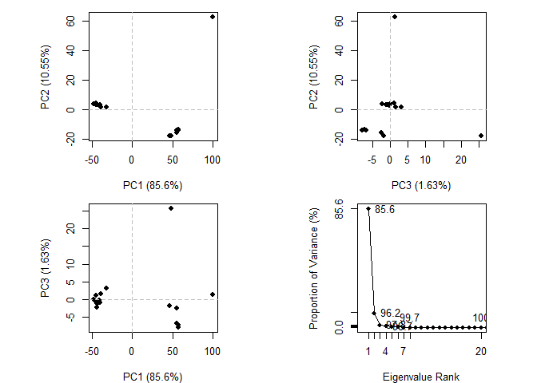

# class 10: Structural Bioinformatics (part 1)
Aigerim (PID: 09919142)

# What is in the PDB?

Downloaded a CSV file with current composition data form:
https://www.rcsb.org/stats/summary

``` r
pdbstats <- read.csv("Data Export Summary.csv", row.names = 1)
head(pdbstats)
```

                              X.ray     EM    NMR Multiple.methods Neutron Other
    Protein (only)          161,663 12,592 12,337              200      74    32
    Protein/Oligosaccharide   9,348  2,167     34                8       2     0
    Protein/NA                8,404  3,924    286                7       0     0
    Nucleic acid (only)       2,758    125  1,477               14       3     1
    Other                       164      9     33                0       0     0
    Oligosaccharide (only)       11      0      6                1       0     4
                              Total
    Protein (only)          186,898
    Protein/Oligosaccharide  11,559
    Protein/NA               12,621
    Nucleic acid (only)       4,378
    Other                       206
    Oligosaccharide (only)       22

``` r
pdbstats$X.ray
```

    [1] "161,663" "9,348"   "8,404"   "2,758"   "164"     "11"     

``` r
x <- "2,2222"
as.numeric(x)
```

    Warning: в результате преобразования созданы NA

    [1] NA

``` r
as.numeric(pdbstats$X.ray)
```

    Warning: в результате преобразования созданы NA

    [1]  NA  NA  NA  NA 164  11

`gsub()` function is used to remove comma in numbers, because it can not
read as a number by program.

``` r
x <- "2,222"
as.numeric(gsub(",", "",x))
```

    [1] 2222

``` r
commasum <- function(x) {
  #Remove comma, convert to numeric and sum
  sum(as.numeric(gsub(",","",x)))
}
```

``` r
#Code -> Extract function and here we can use it as a function
commasum(pdbstats$X.ray)
```

    [1] 182348

`apply()` can use this function to my wee tablet to get all the number i
get

``` r
round(apply(pdbstats, 2, commasum) / 
  commasum(pdbstats$Total) * 100, 2)
```

               X.ray               EM              NMR Multiple.methods 
               84.54             8.72             6.57             0.11 
             Neutron            Other            Total 
                0.04             0.02           100.00 

> Q1: What percentage of structures in the PDB are solved by X-Ray and
> Electron Microscopy.

X.ray: 84.54 %;  
EM: 8.72 %.

> Q2: What proportion of structures in the PDB are protein?

According to PDB data, the Total count of “protein only” structures is
186898, and the sum of all elements is 215684. To calculate proportion
of structures with only proteins, we divide and multiply to 100: 86.69 %

``` r
186989/215684 * 100
```

    [1] 86.69581

> Q. How does the total number of protein strutures in the PDB relate to
> the toral number of protein sequences in UniProt?

``` r
186898 / 250322721 * 100
```

    [1] 0.07466282

> Q3: Type HIV in the PDB website search box on the home page and
> determine how many HIV-1 protease structures are in the current PDB?

26,204 Structures

## Visualizing the HIV-1 protease structure

> Q4: Water molecules normally have 3 atoms. Why do we see just one atom
> per water molecule in this structure?

Just like amino acids, water molecules usually have 3 atoms—2 hydrogen
and 1 oxygen. But when we look at pictures of proteins, we often see
water represented by just one dot. This is to make things easier to
understand and not make the picture too crowded.

> Q5: There is a critical “conserved” water molecule in the binding
> site. Can you identify this water molecule? What residue number does
> this water molecule have

Conserved water molecules in protein binding sites can play critical
roles in maintaining the structural integrity and function of the
protein. In this case it is ASP 25.

#We will use the Mol\* (mol-star) viewer at: https://molstar.org/viewer/

A first image


> Q6: Generate and save a figure clearly showing the two distinct chains
> of HIV-protease along with the ligand. You might also consider showing
> the catalytic residues ASP 25 in each chain and the critical water (we
> recommend “Ball & Stick” for these side-chains). Add this figure to
> your Quarto document.


**Discussion Topic:** Can you think of a way in which indinavir, or even
larger ligands and substrates, could enter the binding site?

Indinavir is a protease inhibitor used in the treatment of HIV. Probably
because of Water molecules that can act as mediators for ligand entry.
When there are water filled channels, ligands may enter and displace
water molecules.

## Working with structures in R

We will use the bio3d package for structural bioinformatics

``` r
library(bio3d)

hiv <- read.pdb("1hsg")
```

      Note: Accessing on-line PDB file

``` r
hiv
```


     Call:  read.pdb(file = "1hsg")

       Total Models#: 1
         Total Atoms#: 1686,  XYZs#: 5058  Chains#: 2  (values: A B)

         Protein Atoms#: 1514  (residues/Calpha atoms#: 198)
         Nucleic acid Atoms#: 0  (residues/phosphate atoms#: 0)

         Non-protein/nucleic Atoms#: 172  (residues: 128)
         Non-protein/nucleic resid values: [ HOH (127), MK1 (1) ]

       Protein sequence:
          PQITLWQRPLVTIKIGGQLKEALLDTGADDTVLEEMSLPGRWKPKMIGGIGGFIKVRQYD
          QILIEICGHKAIGTVLVGPTPVNIIGRNLLTQIGCTLNFPQITLWQRPLVTIKIGGQLKE
          ALLDTGADDTVLEEMSLPGRWKPKMIGGIGGFIKVRQYDQILIEICGHKAIGTVLVGPTP
          VNIIGRNLLTQIGCTLNF

    + attr: atom, xyz, seqres, helix, sheet,
            calpha, remark, call

> Q7: How many amino acid residues are there in this pdb object?

residues/Calpha atoms#: 198

> Q8: Name one of the two non-protein residues?

Water H2O

> Q9: How many protein chains are in this structure?

2: A, B.

``` r
head(hiv$atom)
```

      type eleno elety  alt resid chain resno insert      x      y     z o     b
    1 ATOM     1     N <NA>   PRO     A     1   <NA> 29.361 39.686 5.862 1 38.10
    2 ATOM     2    CA <NA>   PRO     A     1   <NA> 30.307 38.663 5.319 1 40.62
    3 ATOM     3     C <NA>   PRO     A     1   <NA> 29.760 38.071 4.022 1 42.64
    4 ATOM     4     O <NA>   PRO     A     1   <NA> 28.600 38.302 3.676 1 43.40
    5 ATOM     5    CB <NA>   PRO     A     1   <NA> 30.508 37.541 6.342 1 37.87
    6 ATOM     6    CG <NA>   PRO     A     1   <NA> 29.296 37.591 7.162 1 38.40
      segid elesy charge
    1  <NA>     N   <NA>
    2  <NA>     C   <NA>
    3  <NA>     C   <NA>
    4  <NA>     O   <NA>
    5  <NA>     C   <NA>
    6  <NA>     C   <NA>

``` r
aa123(pdbseq(hiv)[25])
```

    [1] "ASP"

#Predicting functional motions of a single structure

``` r
adk <- read.pdb("6s36")
```

      Note: Accessing on-line PDB file
       PDB has ALT records, taking A only, rm.alt=TRUE

``` r
adk
```


     Call:  read.pdb(file = "6s36")

       Total Models#: 1
         Total Atoms#: 1898,  XYZs#: 5694  Chains#: 1  (values: A)

         Protein Atoms#: 1654  (residues/Calpha atoms#: 214)
         Nucleic acid Atoms#: 0  (residues/phosphate atoms#: 0)

         Non-protein/nucleic Atoms#: 244  (residues: 244)
         Non-protein/nucleic resid values: [ CL (3), HOH (238), MG (2), NA (1) ]

       Protein sequence:
          MRIILLGAPGAGKGTQAQFIMEKYGIPQISTGDMLRAAVKSGSELGKQAKDIMDAGKLVT
          DELVIALVKERIAQEDCRNGFLLDGFPRTIPQADAMKEAGINVDYVLEFDVPDELIVDKI
          VGRRVHAPSGRVYHVKFNPPKVEGKDDVTGEELTTRKDDQEETVRKRLVEYHQMTAPLIG
          YYSKEAEAGNTKYAKVDGTKPVAEVRADLEKILG

    + attr: atom, xyz, seqres, helix, sheet,
            calpha, remark, call

Normal mode analysis (NMA) a bioinformatics method to predict functional
motions and large scale changes.

``` r
m <- nma(adk) 
```

     Building Hessian...        Done in 0.04 seconds.
     Diagonalizing Hessian...   Done in 0.55 seconds.

``` r
plot(m)
```


Make a wee movie (aka “trajectory”) of these predicted motions

``` r
mktrj(m, file="adk_movie.pdb")
```

#Quick comparitive

Extract sequence and run a BLAST search

``` r
s <- pdbseq(adk)
blast <- blast.pdb(s)
```

     Searching ... please wait (updates every 5 seconds) RID = Z9ZKU73J016 
     .....
     Reporting 83 hits

``` r
plot(blast)
```

      * Possible cutoff values:    196 9 
                Yielding Nhits:    17 83 

      * Chosen cutoff value of:    196 
                Yielding Nhits:    17 


Get the results from BLAST and download all the top hits.

``` r
hits <- plot(blast)
```

      * Possible cutoff values:    196 9 
                Yielding Nhits:    17 83 

      * Chosen cutoff value of:    196 
                Yielding Nhits:    17 


``` r
hits$pdb.id
```

     [1] "6S36_A" "1AKE_A" "8BQF_A" "6RZE_A" "4X8M_A" "4X8H_A" "1E4V_A" "3HPR_A"
     [9] "5EJE_A" "1E4Y_A" "3X2S_A" "6HAP_A" "6HAM_A" "4K46_A" "4NP6_A" "3GMT_A"
    [17] "4PZL_A"

``` r
# Download releated PDB files
files <- get.pdb(hits$pdb.id, path="pdbs", split=TRUE, gzip=TRUE)
```

    Warning in get.pdb(hits$pdb.id, path = "pdbs", split = TRUE, gzip = TRUE):
    pdbs/6S36.pdb exists. Skipping download

    Warning in get.pdb(hits$pdb.id, path = "pdbs", split = TRUE, gzip = TRUE):
    pdbs/1AKE.pdb exists. Skipping download

    Warning in get.pdb(hits$pdb.id, path = "pdbs", split = TRUE, gzip = TRUE):
    pdbs/8BQF.pdb exists. Skipping download

    Warning in get.pdb(hits$pdb.id, path = "pdbs", split = TRUE, gzip = TRUE):
    pdbs/6RZE.pdb exists. Skipping download

    Warning in get.pdb(hits$pdb.id, path = "pdbs", split = TRUE, gzip = TRUE):
    pdbs/4X8M.pdb exists. Skipping download

    Warning in get.pdb(hits$pdb.id, path = "pdbs", split = TRUE, gzip = TRUE):
    pdbs/4X8H.pdb exists. Skipping download

    Warning in get.pdb(hits$pdb.id, path = "pdbs", split = TRUE, gzip = TRUE):
    pdbs/1E4V.pdb exists. Skipping download

    Warning in get.pdb(hits$pdb.id, path = "pdbs", split = TRUE, gzip = TRUE):
    pdbs/3HPR.pdb exists. Skipping download

    Warning in get.pdb(hits$pdb.id, path = "pdbs", split = TRUE, gzip = TRUE):
    pdbs/5EJE.pdb exists. Skipping download

    Warning in get.pdb(hits$pdb.id, path = "pdbs", split = TRUE, gzip = TRUE):
    pdbs/1E4Y.pdb exists. Skipping download

    Warning in get.pdb(hits$pdb.id, path = "pdbs", split = TRUE, gzip = TRUE):
    pdbs/3X2S.pdb exists. Skipping download

    Warning in get.pdb(hits$pdb.id, path = "pdbs", split = TRUE, gzip = TRUE):
    pdbs/6HAP.pdb exists. Skipping download

    Warning in get.pdb(hits$pdb.id, path = "pdbs", split = TRUE, gzip = TRUE):
    pdbs/6HAM.pdb exists. Skipping download

    Warning in get.pdb(hits$pdb.id, path = "pdbs", split = TRUE, gzip = TRUE):
    pdbs/4K46.pdb exists. Skipping download

    Warning in get.pdb(hits$pdb.id, path = "pdbs", split = TRUE, gzip = TRUE):
    pdbs/4NP6.pdb exists. Skipping download

    Warning in get.pdb(hits$pdb.id, path = "pdbs", split = TRUE, gzip = TRUE):
    pdbs/3GMT.pdb exists. Skipping download

    Warning in get.pdb(hits$pdb.id, path = "pdbs", split = TRUE, gzip = TRUE):
    pdbs/4PZL.pdb exists. Skipping download


      |                                                                            
      |                                                                      |   0%
      |                                                                            
      |====                                                                  |   6%
      |                                                                            
      |========                                                              |  12%
      |                                                                            
      |============                                                          |  18%
      |                                                                            
      |================                                                      |  24%
      |                                                                            
      |=====================                                                 |  29%
      |                                                                            
      |=========================                                             |  35%
      |                                                                            
      |=============================                                         |  41%
      |                                                                            
      |=================================                                     |  47%
      |                                                                            
      |=====================================                                 |  53%
      |                                                                            
      |=========================================                             |  59%
      |                                                                            
      |=============================================                         |  65%
      |                                                                            
      |=================================================                     |  71%
      |                                                                            
      |======================================================                |  76%
      |                                                                            
      |==========================================================            |  82%
      |                                                                            
      |==============================================================        |  88%
      |                                                                            
      |==================================================================    |  94%
      |                                                                            
      |======================================================================| 100%

``` r
# Align releated PDBs
pdbs <- pdbaln(files, fit = TRUE, exefile="msa")
```

    Reading PDB files:
    pdbs/split_chain/6S36_A.pdb
    pdbs/split_chain/1AKE_A.pdb
    pdbs/split_chain/8BQF_A.pdb
    pdbs/split_chain/6RZE_A.pdb
    pdbs/split_chain/4X8M_A.pdb
    pdbs/split_chain/4X8H_A.pdb
    pdbs/split_chain/1E4V_A.pdb
    pdbs/split_chain/3HPR_A.pdb
    pdbs/split_chain/5EJE_A.pdb
    pdbs/split_chain/1E4Y_A.pdb
    pdbs/split_chain/3X2S_A.pdb
    pdbs/split_chain/6HAP_A.pdb
    pdbs/split_chain/6HAM_A.pdb
    pdbs/split_chain/4K46_A.pdb
    pdbs/split_chain/4NP6_A.pdb
    pdbs/split_chain/3GMT_A.pdb
    pdbs/split_chain/4PZL_A.pdb
       PDB has ALT records, taking A only, rm.alt=TRUE
    .   PDB has ALT records, taking A only, rm.alt=TRUE
    .   PDB has ALT records, taking A only, rm.alt=TRUE
    .   PDB has ALT records, taking A only, rm.alt=TRUE
    ....   PDB has ALT records, taking A only, rm.alt=TRUE
    .   PDB has ALT records, taking A only, rm.alt=TRUE
    ....   PDB has ALT records, taking A only, rm.alt=TRUE
    .   PDB has ALT records, taking A only, rm.alt=TRUE
    ....

    Extracting sequences

    pdb/seq: 1   name: pdbs/split_chain/6S36_A.pdb 
       PDB has ALT records, taking A only, rm.alt=TRUE
    pdb/seq: 2   name: pdbs/split_chain/1AKE_A.pdb 
       PDB has ALT records, taking A only, rm.alt=TRUE
    pdb/seq: 3   name: pdbs/split_chain/8BQF_A.pdb 
       PDB has ALT records, taking A only, rm.alt=TRUE
    pdb/seq: 4   name: pdbs/split_chain/6RZE_A.pdb 
       PDB has ALT records, taking A only, rm.alt=TRUE
    pdb/seq: 5   name: pdbs/split_chain/4X8M_A.pdb 
    pdb/seq: 6   name: pdbs/split_chain/4X8H_A.pdb 
    pdb/seq: 7   name: pdbs/split_chain/1E4V_A.pdb 
    pdb/seq: 8   name: pdbs/split_chain/3HPR_A.pdb 
       PDB has ALT records, taking A only, rm.alt=TRUE
    pdb/seq: 9   name: pdbs/split_chain/5EJE_A.pdb 
       PDB has ALT records, taking A only, rm.alt=TRUE
    pdb/seq: 10   name: pdbs/split_chain/1E4Y_A.pdb 
    pdb/seq: 11   name: pdbs/split_chain/3X2S_A.pdb 
    pdb/seq: 12   name: pdbs/split_chain/6HAP_A.pdb 
    pdb/seq: 13   name: pdbs/split_chain/6HAM_A.pdb 
       PDB has ALT records, taking A only, rm.alt=TRUE
    pdb/seq: 14   name: pdbs/split_chain/4K46_A.pdb 
       PDB has ALT records, taking A only, rm.alt=TRUE
    pdb/seq: 15   name: pdbs/split_chain/4NP6_A.pdb 
    pdb/seq: 16   name: pdbs/split_chain/3GMT_A.pdb 
    pdb/seq: 17   name: pdbs/split_chain/4PZL_A.pdb 

##Principal component analysis With these all PDB files

``` r
# Perform PCA
pc.xray <- pca(pdbs)
plot(pc.xray)
```



``` r
# Calculate RMSD
rd <- rmsd(pdbs)
```

    Warning in rmsd(pdbs): No indices provided, using the 199 non NA positions

``` r
# Structure-based clustering
hc.rd <- hclust(dist(rd))
grps.rd <- cutree(hc.rd, k=3)

plot(pc.xray, 1:2, col="grey50", bg=grps.rd, pch=21, cex=1)
```


``` r
mktrj(pc.xray)
```

> Q10. Which of the packages above is found only on BioConductor and not
> CRAN?

BiocManager::install(“msa”)

> Q11. Which of the above packages is not found on BioConductor or
> CRAN?:

“devtools” package itself is not hosted on CRAN or Bioconductor, it is
available on GitHub, and can be installed like:
install.packages(“devtools”)

> Q12. True or False? Functions from the devtools package can be used to
> install packages from GitHub and BitBucket?

TRUE

> Q13. How many amino acids are in this sequence, i.e. how long is this
> sequence?

214

``` r
ids <- paste("ID", 1:17, sep = "")
```

``` r
#Plotting results with ggplot2
library(ggplot2)
```

    Warning: пакет 'ggplot2' был собран под R версии 4.3.3

``` r
library(ggrepel)

df <- data.frame(PC1=pc.xray$z[,1], 
                 PC2=pc.xray$z[,2], 
                 col=as.factor(grps.rd),
                 ids=ids)

p <- ggplot(df) + 
  aes(PC1, PC2, col=col, label=ids) +
  geom_point(size=2) +
  geom_text_repel(max.overlaps = 20) +
  theme(legend.position = "none")
p
```


