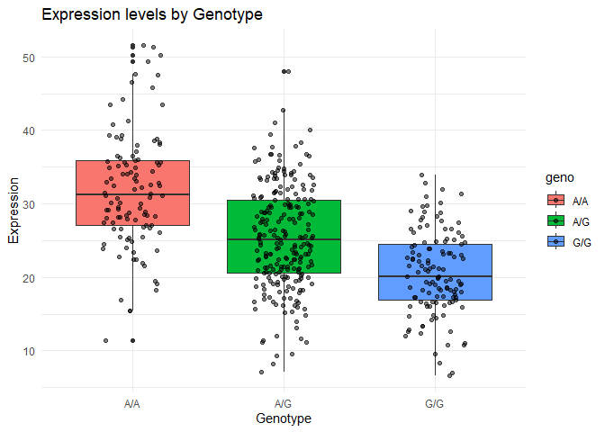

# Class 12: Homework
Aigerim (PID: 09919142)

> Q13: Read this file into R and determine the sample size for each
> genotype and their corresponding median expression levels for each of
> these genotypes

``` r
rs <- read.table("rs8067378.txt", row.names = 1)

head(rs)
```

       sample geno      exp
    1 HG00367  A/G 28.96038
    2 NA20768  A/G 20.24449
    3 HG00361  A/A 31.32628
    4 HG00135  A/A 34.11169
    5 NA18870  G/G 18.25141
    6 NA11993  A/A 32.89721

``` r
summary(rs)
```

        sample              geno                exp        
     Length:462         Length:462         Min.   : 6.675  
     Class :character   Class :character   1st Qu.:20.004  
     Mode  :character   Mode  :character   Median :25.116  
                                           Mean   :25.640  
                                           3rd Qu.:30.779  
                                           Max.   :51.518  

# Subset the data for A/A and G/G genotypes. For this `t.test()` can be used, because it is applied to compare the means of two groups and assess whether there is a significant difference between them:

``` r
expr_A.A <- rs[rs$geno == "A/A", "exp"]
expr_G.G <- rs[rs$geno == "G/G", "exp"]

t_test <- t.test(expr_A.A, expr_G.G)

t_test
```


        Welch Two Sample t-test

    data:  expr_A.A and expr_G.G
    t = 12.214, df = 191.65, p-value < 2.2e-16
    alternative hypothesis: true difference in means is not equal to 0
    95 percent confidence interval:
      9.412243 13.037619
    sample estimates:
    mean of x mean of y 
     31.81864  20.59371 

``` r
library(ggplot2)
```

    Warning: пакет 'ggplot2' был собран под R версии 4.3.3

``` r
ggplot(rs, aes(x = geno, y = exp, fill = geno)) +
  geom_boxplot() +
  geom_jitter(position = position_jitter(0.2), alpha = 0.5) +
  labs(title = "Expression levels by Genotype", x = "Genotype", y = "Expression") +
  theme_minimal()
```



> Q14: Generate a boxplot with a box per genotype, what could you infer
> from the relative expression value between A/A and G/G displayed in
> this plot? Does the SNP effect the expression of ORMDL3?

The boxplot reveals noticeable differences in the median and
distribution of expression levels between A/A and G/G genotypes for
ORMDL3. This visual observation suggests a potential impact of the SNP
on gene expression. The exceptionally small p-value (less than 0.05)
from the statistical test provides strong evidence against the null
hypothesis, reinforcing the idea that the expression levels are
significantly different between the genotypes. Consequently, both the
visual examination of the boxplot and the statistical significance of
the p-value collectively indicate that the SNP does indeed affect the
expression of ORMDL3.
