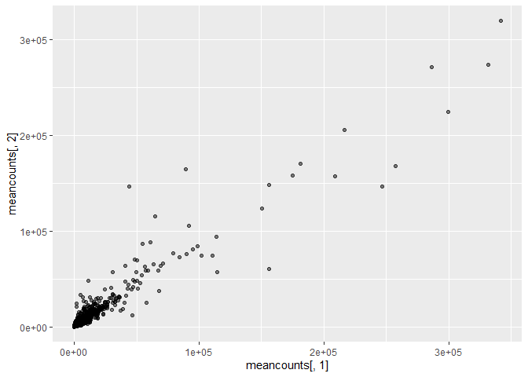

# class 13
Aigerim (PID: 09919142)

Today we are working with the data published RNA-seq experiment where
airway smooth muscle cells were treated with dexamethasone, a synthetic
glucocorticoid steroid with anti-inflammatory effects (Himes et
al. 2014).

##Import countData and colData

``` r
counts <- read.csv("airway_scaledcounts.csv", row.names=1)
metadata <-  read.csv("airway_metadata.csv")
```

``` r
head(counts)
```

                    SRR1039508 SRR1039509 SRR1039512 SRR1039513 SRR1039516
    ENSG00000000003        723        486        904        445       1170
    ENSG00000000005          0          0          0          0          0
    ENSG00000000419        467        523        616        371        582
    ENSG00000000457        347        258        364        237        318
    ENSG00000000460         96         81         73         66        118
    ENSG00000000938          0          0          1          0          2
                    SRR1039517 SRR1039520 SRR1039521
    ENSG00000000003       1097        806        604
    ENSG00000000005          0          0          0
    ENSG00000000419        781        417        509
    ENSG00000000457        447        330        324
    ENSG00000000460         94        102         74
    ENSG00000000938          0          0          0

``` r
head(metadata)
```

              id     dex celltype     geo_id
    1 SRR1039508 control   N61311 GSM1275862
    2 SRR1039509 treated   N61311 GSM1275863
    3 SRR1039512 control  N052611 GSM1275866
    4 SRR1039513 treated  N052611 GSM1275867
    5 SRR1039516 control  N080611 GSM1275870
    6 SRR1039517 treated  N080611 GSM1275871

> Q1. How many genes are in this dataset?

``` r
nrow(counts)
```

    [1] 38694

> Q2. How many total sample?

``` r
ncol(counts)
```

    [1] 8

> Q3. How many ‘control’ cell lines do we have?

``` r
table(metadata$dex)
```


    control treated 
          4       4 

``` r
sum(metadata$dex == "control")
```

    [1] 4

Let’s make sure our `metadata` matches with `counts`

``` r
colnames(counts)
```

    [1] "SRR1039508" "SRR1039509" "SRR1039512" "SRR1039513" "SRR1039516"
    [6] "SRR1039517" "SRR1039520" "SRR1039521"

``` r
metadata$id
```

    [1] "SRR1039508" "SRR1039509" "SRR1039512" "SRR1039513" "SRR1039516"
    [6] "SRR1039517" "SRR1039520" "SRR1039521"

``` r
colnames(counts) == metadata$id
```

    [1] TRUE TRUE TRUE TRUE TRUE TRUE TRUE TRUE

``` r
all(c(T,T,T,T))
```

    [1] TRUE

``` r
all(colnames(counts) == metadata$id)
```

    [1] TRUE

> Q3. How would you make the above code in either approach more robust?
> Is there a function that could help here?

We have a plan - first extract out the control sample - calculate the
row wise means (ie mean counts for eacch gene)

``` r
#First where are the "control"data
control.inds <- metadata$dex == "control"
control.counts <- counts[, control.inds]
control.mean <- apply(control.counts, 1, mean)
```

Now do the same for the treated samples giving us a `treated.mean`

> Q4. Follow the same procedure for the treated samples (i.e. calculate
> the mean per gene across drug treated samples and assign to a labeled
> vector called treated.mean

``` r
#First where are the "treated"data
treated.inds <- metadata$dex == "treated"
treated.counts <- counts[, treated.inds]
treated.mean <- apply(treated.counts, 1, mean)
```

Store these together for ease of book-keeping

``` r
meancounts <- data.frame(control.mean, treated.mean)
```

> Q5 (a). Create a scatter plot showing the mean of the treated samples
> against the mean of the control samples. Your plot should look
> something like the following.

``` r
plot(meancounts)
```


``` r
head(meancounts)
```

                    control.mean treated.mean
    ENSG00000000003       900.75       658.00
    ENSG00000000005         0.00         0.00
    ENSG00000000419       520.50       546.00
    ENSG00000000457       339.75       316.50
    ENSG00000000460        97.25        78.75
    ENSG00000000938         0.75         0.00

> Q5 (b).You could also use the ggplot2 package to make this figure
> producing the plot below. What geom\_?() function would you use for
> this plot?

``` r
library(ggplot2)
```

    Warning: пакет 'ggplot2' был собран под R версии 4.3.3

``` r
ggplot(meancounts, aes(x=meancounts[,1], y=meancounts[,2])) +
  geom_point(alpha=0.5)
```



> Q6. Try plotting both axes on a log scale. What is the argument to
> plot() that allows you to do this?

We have skewed data over a wide range, we care about orders of
magnitude. Let’s do log transform.

``` r
plot(meancounts, log = "xy")
```

    Warning in xy.coords(x, y, xlabel, ylabel, log): 15032 x values <= 0 omitted
    from logarithmic plot

    Warning in xy.coords(x, y, xlabel, ylabel, log): 15281 y values <= 0 omitted
    from logarithmic plot


WE can look at differences here via a little fraction. Divide one
condition by another. EG Treated/control

``` r
log2(20/20)
```

    [1] 0

``` r
log2(40/20)
```

    [1] 1

``` r
log2(10/20)
```

    [1] -1

Log2 fold change for our treated/control

``` r
meancounts$log2fc <- log2(meancounts$treated.mean/
                          meancounts$control.mean)
```

``` r
head(meancounts)
```

                    control.mean treated.mean      log2fc
    ENSG00000000003       900.75       658.00 -0.45303916
    ENSG00000000005         0.00         0.00         NaN
    ENSG00000000419       520.50       546.00  0.06900279
    ENSG00000000457       339.75       316.50 -0.10226805
    ENSG00000000460        97.25        78.75 -0.30441833
    ENSG00000000938         0.75         0.00        -Inf

> Q7. What is the purpose of the arr.ind argument in the which()
> function call above? Why would we then take the first column of the
> output and need to call the unique() function?

Instead of `which()` and `unique()` we used: - `rowSums()` to calculate
where both values in columns 1 and 2 are zero. - A logical vector to
identify rows with non-zero sums. - The original matrix to subset to
exclude rows with non-zero sums.

Because of zero genes we have weird results, we have cut them off.

How can we identify zero count genes in our `meancounts`

``` r
head(meancounts[,1:2] == 0)
```

                    control.mean treated.mean
    ENSG00000000003        FALSE        FALSE
    ENSG00000000005         TRUE         TRUE
    ENSG00000000419        FALSE        FALSE
    ENSG00000000457        FALSE        FALSE
    ENSG00000000460        FALSE        FALSE
    ENSG00000000938        FALSE         TRUE

``` r
zero.sums <- rowSums(meancounts[,1:2] == 0)
to.rm.ind <- zero.sums > 0
mycounts <- meancounts[!to.rm.ind,]
head(mycounts)
```

                    control.mean treated.mean      log2fc
    ENSG00000000003       900.75       658.00 -0.45303916
    ENSG00000000419       520.50       546.00  0.06900279
    ENSG00000000457       339.75       316.50 -0.10226805
    ENSG00000000460        97.25        78.75 -0.30441833
    ENSG00000000971      5219.00      6687.50  0.35769358
    ENSG00000001036      2327.00      1785.75 -0.38194109

A common threshold for calling something “differential expressed” is a
log2 fold-change value of +2 or -2.

> Q8. Using the up.ind vector above can you determine how many up
> regulated genes we have at the greater than 2 fc level?

``` r
sum(mycounts$log2fc >= +2)
```

    [1] 314

> Q9. Using the down.ind vector above can you determine how many down
> regulated genes we have at the greater than 2 fc level?

``` r
sum(mycounts$log2fc <= -2)
```

    [1] 485

> Q10. Do you trust these results? Why or why not? How many of our
> remaining genes are “up regulated”.

We’ve conducted our analysis using fold change, but it’s important to
note that a large fold change doesn’t necessarily mean the difference is
statistically significant, especially without considering p-values. We
haven’t taken steps to assess the significance of the observed
differences yet. The current results, without considering statistical
significance, may be misleading.

Let’s do in correct way

``` r
library(DESeq2)
```

    Warning: пакет 'DESeq2' был собран под R версии 4.3.3

DESeq2 wants

``` r
dds <- DESeqDataSetFromMatrix(countData = counts,
                       colData = metadata,
                       design =~dex)
```

    converting counts to integer mode

    Warning in DESeqDataSet(se, design = design, ignoreRank): some variables in
    design formula are characters, converting to factors

The main analysis function is called `DESeq()` and we can now pass it
our setup input object with all the data we need.

``` r
dds <- DESeq(dds)
```

    estimating size factors

    estimating dispersions

    gene-wise dispersion estimates

    mean-dispersion relationship

    final dispersion estimates

    fitting model and testing

To get the results out of this `dds` object we can use the DESeq
function `results()`

``` r
res <- results(dds)
head(res)
```

    log2 fold change (MLE): dex treated vs control 
    Wald test p-value: dex treated vs control 
    DataFrame with 6 rows and 6 columns
                      baseMean log2FoldChange     lfcSE      stat    pvalue
                     <numeric>      <numeric> <numeric> <numeric> <numeric>
    ENSG00000000003 747.194195     -0.3507030  0.168246 -2.084470 0.0371175
    ENSG00000000005   0.000000             NA        NA        NA        NA
    ENSG00000000419 520.134160      0.2061078  0.101059  2.039475 0.0414026
    ENSG00000000457 322.664844      0.0245269  0.145145  0.168982 0.8658106
    ENSG00000000460  87.682625     -0.1471420  0.257007 -0.572521 0.5669691
    ENSG00000000938   0.319167     -1.7322890  3.493601 -0.495846 0.6200029
                         padj
                    <numeric>
    ENSG00000000003  0.163035
    ENSG00000000005        NA
    ENSG00000000419  0.176032
    ENSG00000000457  0.961694
    ENSG00000000460  0.815849
    ENSG00000000938        NA

##Volcano plot

A common visualization for this type of plot is called a volcano plot.
It is plot of log fold change against P-value.

``` r
plot(res$log2FoldChange, res$padj)
```


``` r
plot(res$log2FoldChange, log(res$padj))
```


Adding “-” makes results upside down

``` r
plot(res$log2FoldChange, -log(res$padj),
     ylab="-log(p-value)",
     xlab="log2FoldChange")
abline(v=-2, col="red")
abline(v=2, col="red")
abline(h=-log(0.05), col="red")
```


Save our results thus far

``` r
write.csv(res, file="myresults.csv")
```

##Adding annotation data

Our result table so far only contains the Ensembl gene IDs. However, we
want to be able to make sense of these genes. Minimally we should add
conventional gene symnbol names, but also add identifiers for other
databases that we might want to look in later in later for info about
these genes.

``` r
library("AnnotationDbi")
library("org.Hs.eg.db")
```

> Q11. Run the mapIds() function two more times to add the Entrez ID and
> UniProt accession and GENENAME as new columns called
> res*e**n**t**r**e**z*, *r**e**s*uniprot and res$genename.

``` r
columns(org.Hs.eg.db)
```

     [1] "ACCNUM"       "ALIAS"        "ENSEMBL"      "ENSEMBLPROT"  "ENSEMBLTRANS"
     [6] "ENTREZID"     "ENZYME"       "EVIDENCE"     "EVIDENCEALL"  "GENENAME"    
    [11] "GENETYPE"     "GO"           "GOALL"        "IPI"          "MAP"         
    [16] "OMIM"         "ONTOLOGY"     "ONTOLOGYALL"  "PATH"         "PFAM"        
    [21] "PMID"         "PROSITE"      "REFSEQ"       "SYMBOL"       "UCSCKG"      
    [26] "UNIPROT"     

``` r
res$symbol <- mapIds(org.Hs.eg.db,
                     keys=row.names(res), 
                     keytype="ENSEMBL", 
                     column="SYMBOL",   
                     multiVals="first")
```

    'select()' returned 1:many mapping between keys and columns

``` r
head(res)
```

    log2 fold change (MLE): dex treated vs control 
    Wald test p-value: dex treated vs control 
    DataFrame with 6 rows and 7 columns
                      baseMean log2FoldChange     lfcSE      stat    pvalue
                     <numeric>      <numeric> <numeric> <numeric> <numeric>
    ENSG00000000003 747.194195     -0.3507030  0.168246 -2.084470 0.0371175
    ENSG00000000005   0.000000             NA        NA        NA        NA
    ENSG00000000419 520.134160      0.2061078  0.101059  2.039475 0.0414026
    ENSG00000000457 322.664844      0.0245269  0.145145  0.168982 0.8658106
    ENSG00000000460  87.682625     -0.1471420  0.257007 -0.572521 0.5669691
    ENSG00000000938   0.319167     -1.7322890  3.493601 -0.495846 0.6200029
                         padj      symbol
                    <numeric> <character>
    ENSG00000000003  0.163035      TSPAN6
    ENSG00000000005        NA        TNMD
    ENSG00000000419  0.176032        DPM1
    ENSG00000000457  0.961694       SCYL3
    ENSG00000000460  0.815849       FIRRM
    ENSG00000000938        NA         FGR

We also need to ENTREZ ids so we can “talk to”

``` r
res$entrez <- mapIds(org.Hs.eg.db,
                     keys=row.names(res), # Our genenames
                     keytype="ENSEMBL",   # The format of our genenames
                     column="ENTREZID",   # The new format we want to add
                     multiVals="first")
```

    'select()' returned 1:many mapping between keys and columns

``` r
head(res)
```

    log2 fold change (MLE): dex treated vs control 
    Wald test p-value: dex treated vs control 
    DataFrame with 6 rows and 8 columns
                      baseMean log2FoldChange     lfcSE      stat    pvalue
                     <numeric>      <numeric> <numeric> <numeric> <numeric>
    ENSG00000000003 747.194195     -0.3507030  0.168246 -2.084470 0.0371175
    ENSG00000000005   0.000000             NA        NA        NA        NA
    ENSG00000000419 520.134160      0.2061078  0.101059  2.039475 0.0414026
    ENSG00000000457 322.664844      0.0245269  0.145145  0.168982 0.8658106
    ENSG00000000460  87.682625     -0.1471420  0.257007 -0.572521 0.5669691
    ENSG00000000938   0.319167     -1.7322890  3.493601 -0.495846 0.6200029
                         padj      symbol      entrez
                    <numeric> <character> <character>
    ENSG00000000003  0.163035      TSPAN6        7105
    ENSG00000000005        NA        TNMD       64102
    ENSG00000000419  0.176032        DPM1        8813
    ENSG00000000457  0.961694       SCYL3       57147
    ENSG00000000460  0.815849       FIRRM       55732
    ENSG00000000938        NA         FGR        2268
